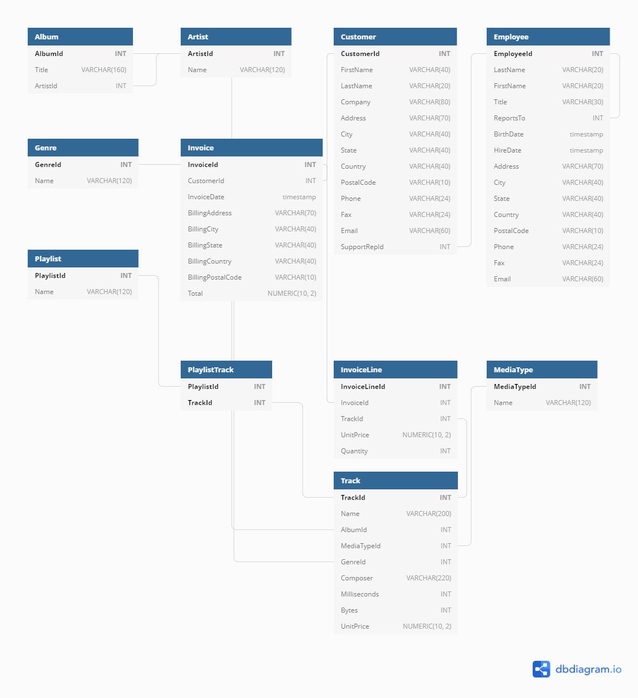
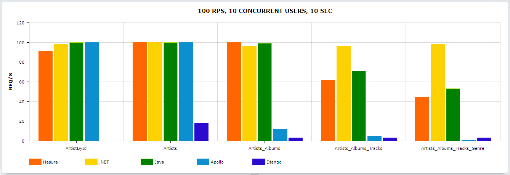
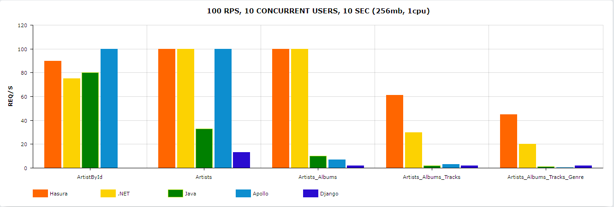

# GraphQL Chinook Bake-Off
- [GraphQL Chinook Bake-Off](#graphql-chinook-bake-off)
  - [Introduction](#introduction)
  - [Implementations](#implementations)
  - [The Schema](#the-schema)
  - [Queries](#queries)
  - [Development & Benchmarking Process](#development--benchmarking-process)
  - [Results](#results)
    - [Results A (100RPS, 10 seconds, 10 concurrent users)](#results-a-100rps-10-seconds-10-concurrent-users)
      - [Results A Benchmarking Logs](#results-a-benchmarking-logs)
    - [Results B (100RPS, 10 seconds, 10 concurrent users, resource-constrained)](#results-b-100rps-10-seconds-10-concurrent-users-resource-constrained)
      - [Results B Benchmarking Logs](#results-b-benchmarking-logs)

## Introduction

This repo contains multiple implementations of the same query-only GraphQL API:
- An identical database schema is used throughout
- Each has been done with a different language and framework

Performance is critical to Hasura. We felt it was important to set up an environment that allowed continually measuring comparative performance, with minimal time investment from engineers interested in doing so.

The repo contents allow to stand up a database (including schema and seed data), and the multiple server implementations, by simply running `docker-compose up`. Then tools like [graphql-bench](https://github.com/hasura/graphql-bench) and [cAdvisor](https://github.com/google/cadvisor) can be run to collect data.


## Implementations

| Framework    | Framework Version | Language | Language Version | Postgres | SQL Server | Tool(s) + Versions                     |
| ------------ | ----------------- | -------- | ---------------- | -------- | ---------- | -------------------------------------- |
| Hasura       | v2.0.9            | Haskell  | 8.10             | ✔️        | ❌          |                                        |
| .NET         | v5                | C#       | 9                | ✔️        | ❌          | HotChocolate (12), EntityFramework (5) |
| Quarkus      | v2.2.2            | Java     | 11.0.8           | ✔️        | ❌          | Hibernate (5.5.7.Final), JPA           |
| Apollo       | v3                | Node.js  | 14.17.4          | ✔️        | ❌          | Knex (0.95.11)                         |
| Django       | v3.2.6            | Python   | 3.8.6            | ✔️        | ❌          | Graphene (3.0.7b)                      |
| AsyncGraphQL |                   | Rust     | 1.54             | ❌        | ❌          | ActixWeb                               |


## The Schema

The database model and dataset used for this is the ["Chinook" database](https://github.com/lerocha/chinook-database):



## Queries

Below are the current iteration of queries in the benchmark suite, using Hasura's syntax for them:

```graphql
query Hasura_ArtistById {
   artists(where: { id: { _eq: 1 } }) {
      id
      name
   }
}

query Hasura_AllArtists {
   artists {
      id
      name
   }
}

query Hasura_AllArtists_Albums {
   artists {
      id
      name
      albums {
         id
         title
      }
   }
}

query Hasura_AllArtistsAlbumsTracks {
   artists {
      id
      name
      albums {
         id
         title
         tracks {
            id
            name
            composer
         }
      }
   }
}

query Hasura_AllArtistsAlbumsTracks_Genres {
   artists {
      id
      name
      albums {
         id
         title
         tracks {
            id
            name
            composer
            genre {
               id
               name
            }
         }
      }
   }
}
```


## Development & Benchmarking Process

The general structure of the project is:
- Inside of the `/apps` directory is a folder-per-language
- The database-specific implementations for each language + framework pairing can be placed underneath these
  - The argument could be made that it would be cleaner if there were only one-per-language, and the database differences were done at an environmental level
  - This is probably true -- but managing this across half a dozen languages is more complicated than copy-pasting the entire project ;^)
- In the `/bench-output` folder are a series of small convenience shell scripts that wrap calls to `graphql-bench` Docker image
  - Additionally the configuration files for each language are here -- this is where you can tweak queries and other benchmark parameters

Development has been done by running the Github Codespaces docker image as a VS Code "Devcontainer" locally.

This mounts the project files into a Docker image that contains most common languages and tools.
With this there is zero setup needed to work on any language implementation in the project.

VS Code will prompt to launch as a "Remote Container" when opening this project, and you only have to accept.
If you are interested in details, you can look in the `.vscode` folder.

```sh
├── apps
│   ├── dotnet
│   ├── hasura
│   ├── java
│   ├── node
│   ├── python
│   └── rust
│  
├── bench-output
│   ├── config.apollo.yaml
│   ├── config.django.yaml
│   ├── config.dotnet.yaml
│   ├── config.hasura.yaml
│   ├── config.quarkus.yaml
│   ├── run.apollo.sh
│   ├── run.django.sh
│   ├── run.dotnet.sh
│   ├── run.hasura.sh
│   └── run.quarkus.sh
│
├── docker-compose.yaml
└── README.md
```

To set up the benchmarking environment, do the following:
```sh
$ git clone <repo-name>
# You can modify the memory + CPU constraints in the docker-compose.yaml
# If you DO use any constraints, you need to run in "compatibility" mode to enforce them:
$ docker-compose --compatibility up -d
# At this point, you should have services running at:
# Hasura  = http://localhost:8080
# Quarkus = http://localhost:8081
# .NET    = http://localhost:5000
# Django  = http://localhost:8000
# Apollo  = http://localhost:4000
#
# We need to configure Hasura -- Hasura contains the "original" DB Schema and seed records the other frameworks will use
$ cd apps/hasura
$ hasura migrate apply
$ hasura metadata apply
# This seeds the database
$ hasura seeds apply
$ cd ../../
# Now we need to build the graphql-bench Docker image:
$ git clone https://github.com/hasura/graphql-bench
$ docker build -t graphql-bench:latest ./graphql-bench/app
# Finally everything is done, now we're able to run benchmarks using graphql-bench
$ cd bench-output
# Let's benchmark Hasura:
$ ./run.hasura.sh
# That's a shortcut for:
$ docker run --net=host -v "$PWD":/app/tmp -it \
  graphql-bench query \
  --config="./tmp/config.hasura.yaml" \
  --outfile="./tmp/report.hasura.json"
```

## Results

### Results A (100RPS, 10 seconds, 10 concurrent users)

Attempted fixed request rate (100 requests per second) with 10 concurrent users

**Requests Per Second**

|                                | Hasura | .NET | Java | Apollo | Django |
| ------------------------------ | ------ | ---- | ---- | ------ | ------ |
| ArtistById                     | 91     | 98   | 100  | 100    | x      |
| AllArtists                     | 100    | 100  | 100  | 100    | 18     |
| AllArtists_Albums              | 100    | 96   | 99   | 12     | 3      |
| AllArtists_Albums_Tracks       | 61.5   | 96   | 71   | 5      | 3      |
| AllArtists_Albums_Tracks_Genre | 44     | 98   | 53   | 0.7    | 3      |



**Latency (ms, p90)**

|                                | Hasura | .NET | Java   | Apollo | Django |
| ------------------------------ | ------ | ---- | ------ | ------ | ------ |
| ArtistById                     | 7.24   | 3.59 | 2.80   | 4.73   | x      |
| AllArtists                     | 7.26   | 3.46 | 4.76   | 5.97   | 642    |
| AllArtists_Albums              | 15.5   | 5.5  | 16.24  | 847    | 4150   |
| AllArtists_Albums_Tracks       | 170    | 35.9 | 142.68 | 2110   | 3480   |
| AllArtists_Albums_Tracks_Genre | 241    | 58.6 | 192.76 | 13200  | 4730   |

#### Results A Benchmarking Logs

Below you can expand the sections to view the raw output from the run of the benchmarking tool, if you would like more information:

<details>
<summary>Hasura</summary>

```ini
$ docker run --net=host -v "$PWD":/app/tmp -it \
>   graphql-bench query \
>   --config="./tmp/config.hasura.yaml" \
>   --outfile="./tmp/report.hasura-100rps.json"

          /\      |‾‾| /‾‾/   /‾‾/   
     /\  /  \     |  |/  /   /  /    
    /  \/    \    |     (   /   ‾‾\  
   /          \   |  |\  \ |  (‾)  | 
  / __________ \  |__| \__\ \_____/ .io

  execution: local
     script: /app/queries/bin/k6/loadScript.js
     output: json (/app/queries/src/executors/k6/tmp/k6_raw_stats.json)

  scenarios: (100.00%) 1 scenario, 10 max VUs, 40s max duration (incl. graceful stop):
           * Hasura_ArtistById: 100.00 iterations/s for 10s (maxVUs: 10, gracefulStop: 30s)

WARN[0000] Insufficient VUs, reached 10 active VUs and cannot initialize more  executor=constant-arrival-rate scenario=Hasura_ArtistById

running (10.0s), 00/10 VUs, 912 complete and 0 interrupted iterations
Hasura_ArtistById ✓ [======================================] 00/10 VUs  10s  100 iters/s

     ✓ is status 200
     ✓ no error in body

     checks.........................: 100.00% ✓ 1824      ✗ 0   
     data_received..................: 240 kB  24 kB/s
     data_sent......................: 227 kB  23 kB/s
     dropped_iterations.............: 88      8.798115/s
     http_req_blocked...............: avg=10.24µs  min=2.9µs  med=5.4µs    max=466.6µs p(90)=8.4µs    p(95)=11.5µs  
     http_req_connecting............: avg=2.39µs   min=0s     med=0s       max=295.2µs p(90)=0s       p(95)=0s      
     http_req_duration..............: avg=18.7ms   min=4.75ms med=6.18ms   max=1.27s   p(90)=7.24ms   p(95)=8.28ms  
       { expected_response:true }...: avg=18.7ms   min=4.75ms med=6.18ms   max=1.27s   p(90)=7.24ms   p(95)=8.28ms  
     http_req_failed................: 0.00%   ✓ 0         ✗ 912 
     http_req_receiving.............: avg=108.75µs min=62.7µs med=102.15µs max=285.7µs p(90)=154.21µs p(95)=171.48µs
     http_req_sending...............: avg=73.67µs  min=16µs   med=69.59µs  max=331.9µs p(90)=111.6µs  p(95)=137.03µs
     http_req_tls_handshaking.......: avg=0s       min=0s     med=0s       max=0s      p(90)=0s       p(95)=0s      
     http_req_waiting...............: avg=18.52ms  min=4.6ms  med=6ms      max=1.27s   p(90)=7.04ms   p(95)=8.08ms  
     http_reqs......................: 912     91.180464/s
     iteration_duration.............: avg=19.02ms  min=5ms    med=6.51ms   max=1.27s   p(90)=7.59ms   p(95)=8.67ms  
     iterations.....................: 912     91.180464/s
     vus............................: 10      min=10      max=10
     vus_max........................: 10      min=10      max=10


          /\      |‾‾| /‾‾/   /‾‾/   
     /\  /  \     |  |/  /   /  /    
    /  \/    \    |     (   /   ‾‾\  
   /          \   |  |\  \ |  (‾)  | 
  / __________ \  |__| \__\ \_____/ .io

  execution: local
     script: /app/queries/bin/k6/loadScript.js
     output: json (/app/queries/src/executors/k6/tmp/k6_raw_stats.json)

  scenarios: (100.00%) 1 scenario, 10 max VUs, 40s max duration (incl. graceful stop):
           * Hasura_AllArtists: 100.00 iterations/s for 10s (maxVUs: 10, gracefulStop: 30s)


running (10.0s), 00/10 VUs, 1001 complete and 0 interrupted iterations
Hasura_AllArtists ✓ [======================================] 00/10 VUs  10s  100 iters/s

     ✓ is status 200
     ✓ no error in body

     checks.........................: 100.00% ✓ 2002       ✗ 0   
     data_received..................: 12 MB   1.2 MB/s
     data_sent......................: 221 kB  22 kB/s
     http_req_blocked...............: avg=10.4µs   min=3.1µs  med=5.2µs   max=729.7µs  p(90)=7.9µs   p(95)=10.7µs 
     http_req_connecting............: avg=2.69µs   min=0s     med=0s      max=527.1µs  p(90)=0s      p(95)=0s     
     http_req_duration..............: avg=7.13ms   min=5.33ms med=6.47ms  max=63.02ms  p(90)=7.26ms  p(95)=7.68ms 
       { expected_response:true }...: avg=7.13ms   min=5.33ms med=6.47ms  max=63.02ms  p(90)=7.26ms  p(95)=7.68ms 
     http_req_failed................: 0.00%   ✓ 0          ✗ 1001
     http_req_receiving.............: avg=132.84µs min=62.4µs med=122.3µs max=319.29µs p(90)=176.3µs p(95)=204.6µs
     http_req_sending...............: avg=65.88µs  min=16.2µs med=53.1µs  max=436.2µs  p(90)=102.5µs p(95)=118.1µs
     http_req_tls_handshaking.......: avg=0s       min=0s     med=0s      max=0s       p(90)=0s      p(95)=0s     
     http_req_waiting...............: avg=6.94ms   min=5.14ms med=6.27ms  max=62.81ms  p(90)=7.08ms  p(95)=7.5ms  
     http_reqs......................: 1001    100.021715/s
     iteration_duration.............: avg=7.53ms   min=5.68ms med=6.86ms  max=63.53ms  p(90)=7.68ms  p(95)=8.07ms 
     iterations.....................: 1001    100.021715/s
     vus............................: 10      min=10       max=10
     vus_max........................: 10      min=10       max=10


          /\      |‾‾| /‾‾/   /‾‾/   
     /\  /  \     |  |/  /   /  /    
    /  \/    \    |     (   /   ‾‾\  
   /          \   |  |\  \ |  (‾)  | 
  / __________ \  |__| \__\ \_____/ .io

  execution: local
     script: /app/queries/bin/k6/loadScript.js
     output: json (/app/queries/src/executors/k6/tmp/k6_raw_stats.json)

  scenarios: (100.00%) 1 scenario, 10 max VUs, 40s max duration (incl. graceful stop):
           * Hasura_AllArtists_Albums: 100.00 iterations/s for 10s (maxVUs: 10, gracefulStop: 30s)


running (10.0s), 00/10 VUs, 1001 complete and 0 interrupted iterations
Hasura_AllArtists_Albums ✓ [======================================] 00/10 VUs  10s  100 iters/s

     ✓ is status 200
     ✓ no error in body

     checks.........................: 100.00% ✓ 2002      ✗ 0   
     data_received..................: 31 MB   3.1 MB/s
     data_sent......................: 273 kB  27 kB/s
     http_req_blocked...............: avg=10.62µs  min=3.5µs   med=5.4µs    max=1.27ms  p(90)=7.7µs   p(95)=11.6µs 
     http_req_connecting............: avg=2.37µs   min=0s      med=0s       max=384.7µs p(90)=0s      p(95)=0s     
     http_req_duration..............: avg=15.26ms  min=13.23ms med=14.53ms  max=73.18ms p(90)=15.57ms p(95)=16.15ms
       { expected_response:true }...: avg=15.26ms  min=13.23ms med=14.53ms  max=73.18ms p(90)=15.57ms p(95)=16.15ms
     http_req_failed................: 0.00%   ✓ 0         ✗ 1001
     http_req_receiving.............: avg=139.04µs min=56.3µs  med=130.89µs max=495.4µs p(90)=166.5µs p(95)=180.7µs
     http_req_sending...............: avg=65.51µs  min=17.8µs  med=53.8µs   max=237.3µs p(90)=98.7µs  p(95)=121.2µs
     http_req_tls_handshaking.......: avg=0s       min=0s      med=0s       max=0s      p(90)=0s      p(95)=0s     
     http_req_waiting...............: avg=15.06ms  min=13.05ms med=14.33ms  max=72.99ms p(90)=15.36ms p(95)=15.95ms
     http_reqs......................: 1001    99.930392/s
     iteration_duration.............: avg=15.78ms  min=13.73ms med=15.05ms  max=73.74ms p(90)=16.08ms p(95)=16.66ms
     iterations.....................: 1001    99.930392/s
     vus............................: 10      min=10      max=10
     vus_max........................: 10      min=10      max=10


          /\      |‾‾| /‾‾/   /‾‾/   
     /\  /  \     |  |/  /   /  /    
    /  \/    \    |     (   /   ‾‾\  
   /          \   |  |\  \ |  (‾)  | 
  / __________ \  |__| \__\ \_____/ .io

  execution: local
     script: /app/queries/bin/k6/loadScript.js
     output: json (/app/queries/src/executors/k6/tmp/k6_raw_stats.json)

  scenarios: (100.00%) 1 scenario, 10 max VUs, 40s max duration (incl. graceful stop):
           * Hasura_AllArtistsAlbumsTracks: 100.00 iterations/s for 10s (maxVUs: 10, gracefulStop: 30s)

WARN[0000] Insufficient VUs, reached 10 active VUs and cannot initialize more  executor=constant-arrival-rate scenario=Hasura_AllArtistsAlbumsTracks

running (10.1s), 00/10 VUs, 620 complete and 0 interrupted iterations
Hasura_AllArtists_Albums_Tr... ✓ [======================================] 00/10 VUs  10s  100 iters/s

     ✓ is status 200
     ✓ no error in body

     checks.........................: 100.00% ✓ 1240      ✗ 0   
     data_received..................: 175 MB  17 MB/s
     data_sent......................: 216 kB  22 kB/s
     dropped_iterations.............: 381     37.830133/s
     http_req_blocked...............: avg=15.85µs  min=4.2µs   med=8.8µs    max=511.9µs  p(90)=11.6µs   p(95)=15.61µs 
     http_req_connecting............: avg=4.04µs   min=0s      med=0s       max=327.7µs  p(90)=0s       p(95)=0s      
     http_req_duration..............: avg=149.95ms min=34.17ms med=149.83ms max=206.24ms p(90)=170.87ms p(95)=178.06ms
       { expected_response:true }...: avg=149.95ms min=34.17ms med=149.83ms max=206.24ms p(90)=170.87ms p(95)=178.06ms
     http_req_failed................: 0.00%   ✓ 0         ✗ 620 
     http_req_receiving.............: avg=458.18µs min=143.4µs med=408.25µs max=4.68ms   p(90)=633.26µs p(95)=762.65µs
     http_req_sending...............: avg=91.51µs  min=23.3µs  med=88.25µs  max=552.2µs  p(90)=117.1µs  p(95)=133.8µs 
     http_req_tls_handshaking.......: avg=0s       min=0s      med=0s       max=0s       p(90)=0s       p(95)=0s      
     http_req_waiting...............: avg=149.4ms  min=33.29ms med=149.43ms max=205.18ms p(90)=170.33ms p(95)=177.62ms
     http_reqs......................: 620     61.560847/s
     iteration_duration.............: avg=152.56ms min=36.72ms med=152.55ms max=208.38ms p(90)=173.5ms  p(95)=181.02ms
     iterations.....................: 620     61.560847/s
     vus............................: 10      min=10      max=10
     vus_max........................: 10      min=10      max=10


          /\      |‾‾| /‾‾/   /‾‾/   
     /\  /  \     |  |/  /   /  /    
    /  \/    \    |     (   /   ‾‾\  
   /          \   |  |\  \ |  (‾)  | 
  / __________ \  |__| \__\ \_____/ .io

  execution: local
     script: /app/queries/bin/k6/loadScript.js
     output: json (/app/queries/src/executors/k6/tmp/k6_raw_stats.json)

  scenarios: (100.00%) 1 scenario, 10 max VUs, 40s max duration (incl. graceful stop):
           * Hasura_AllArtistsAlbumsTracks_Genres: 100.00 iterations/s for 10s (maxVUs: 10, gracefulStop: 30s)

WARN[0000] Insufficient VUs, reached 10 active VUs and cannot initialize more  executor=constant-arrival-rate scenario=Hasura_AllArtistsAlbumsTracks_Genres

running (10.1s), 00/10 VUs, 446 complete and 0 interrupted iterations
Hasura_AllArtists_Albums_Tr... ✓ [======================================] 00/10 VUs  10s  100 iters/s

     ✓ is status 200
     ✓ no error in body

     checks.........................: 100.00% ✓ 892       ✗ 0   
     data_received..................: 179 MB  18 MB/s
     data_sent......................: 185 kB  18 kB/s
     dropped_iterations.............: 555     54.977474/s
     http_req_blocked...............: avg=19.24µs  min=4.8µs   med=8.9µs    max=701.3µs  p(90)=12.15µs  p(95)=15.52µs 
     http_req_connecting............: avg=6.18µs   min=0s      med=0s       max=555.4µs  p(90)=0s       p(95)=0s      
     http_req_duration..............: avg=214.36ms min=47.97ms med=211.29ms max=276.9ms  p(90)=241.48ms p(95)=245.72ms
       { expected_response:true }...: avg=214.36ms min=47.97ms med=211.29ms max=276.9ms  p(90)=241.48ms p(95)=245.72ms
     http_req_failed................: 0.00%   ✓ 0         ✗ 446 
     http_req_receiving.............: avg=538.56µs min=240.6µs med=490.75µs max=4.23ms   p(90)=723.8µs  p(95)=871.5µs 
     http_req_sending...............: avg=90.71µs  min=26.8µs  med=85.7µs   max=400.4µs  p(90)=125.05µs p(95)=148.57µs
     http_req_tls_handshaking.......: avg=0s       min=0s      med=0s       max=0s       p(90)=0s       p(95)=0s      
     http_req_waiting...............: avg=213.73ms min=47.11ms med=210.76ms max=276.27ms p(90)=240.75ms p(95)=245.11ms
     http_reqs......................: 446     44.180096/s
     iteration_duration.............: avg=217.75ms min=51.71ms med=214.42ms max=279.75ms p(90)=244.61ms p(95)=249.05ms
     iterations.....................: 446     44.180096/s
     vus............................: 10      min=10      max=10
     vus_max........................: 10      min=10      max=10
```

</details>

<details>
<summary>Django</summary>

```ini
$ docker run --net=host -v "$PWD":/app/tmp -it \
>   graphql-bench query \
>   --config="./tmp/config.django.yaml" \
>   --outfile="./tmp/report.django-100rps.json"

          /\      |‾‾| /‾‾/   /‾‾/   
     /\  /  \     |  |/  /   /  /    
    /  \/    \    |     (   /   ‾‾\  
   /          \   |  |\  \ |  (‾)  | 
  / __________ \  |__| \__\ \_____/ .io

  execution: local
     script: /app/queries/bin/k6/loadScript.js
     output: json (/app/queries/src/executors/k6/tmp/k6_raw_stats.json)

  scenarios: (100.00%) 1 scenario, 10 max VUs, 40s max duration (incl. graceful stop):
           * Django_AllArtists: 100.00 iterations/s for 10s (maxVUs: 10, gracefulStop: 30s)

WARN[0000] Insufficient VUs, reached 10 active VUs and cannot initialize more  executor=constant-arrival-rate scenario=Django_AllArtists

running (10.4s), 00/10 VUs, 189 complete and 0 interrupted iterations
Django_AllArtists ✓ [======================================] 00/10 VUs  10s  100 iters/s

     ✓ is status 200
     ✓ no error in body

     checks.........................: 100.00% ✓ 378       ✗ 0   
     data_received..................: 2.2 MB  215 kB/s
     data_sent......................: 42 kB   4.1 kB/s
     dropped_iterations.............: 812     77.945752/s
     http_req_blocked...............: avg=28.52µs  min=3µs      med=5.3µs    max=978.6µs  p(90)=9.96µs   p(95)=163.95µs
     http_req_connecting............: avg=15.94µs  min=0s       med=0s       max=802.6µs  p(90)=0s       p(95)=94.25µs 
     http_req_duration..............: avg=531.83ms min=268.05ms med=524.98ms max=761.95ms p(90)=641.18ms p(95)=672.17ms
       { expected_response:true }...: avg=531.83ms min=268.05ms med=524.98ms max=761.95ms p(90)=641.18ms p(95)=672.17ms
     http_req_failed................: 0.00%   ✓ 0         ✗ 189 
     http_req_receiving.............: avg=13.35ms  min=90.8µs   med=5.02ms   max=149.74ms p(90)=34.86ms  p(95)=64.08ms 
     http_req_sending...............: avg=65.69µs  min=17.1µs   med=54.2µs   max=220.2µs  p(90)=101.44µs p(95)=113.11µs
     http_req_tls_handshaking.......: avg=0s       min=0s       med=0s       max=0s       p(90)=0s       p(95)=0s      
     http_req_waiting...............: avg=518.41ms min=267.81ms med=514.63ms max=757.85ms p(90)=625.01ms p(95)=653.89ms
     http_reqs......................: 189     18.142546/s
     iteration_duration.............: avg=532.28ms min=268.51ms med=525.52ms max=762.27ms p(90)=641.99ms p(95)=672.67ms
     iterations.....................: 189     18.142546/s
     vus............................: 10      min=10      max=10
     vus_max........................: 10      min=10      max=10


          /\      |‾‾| /‾‾/   /‾‾/   
     /\  /  \     |  |/  /   /  /    
    /  \/    \    |     (   /   ‾‾\  
   /          \   |  |\  \ |  (‾)  | 
  / __________ \  |__| \__\ \_____/ .io

  execution: local
     script: /app/queries/bin/k6/loadScript.js
     output: json (/app/queries/src/executors/k6/tmp/k6_raw_stats.json)

  scenarios: (100.00%) 1 scenario, 10 max VUs, 40s max duration (incl. graceful stop):
           * Django_AllArtists_Albums: 100.00 iterations/s for 10s (maxVUs: 10, gracefulStop: 30s)

WARN[0000] Insufficient VUs, reached 10 active VUs and cannot initialize more  executor=constant-arrival-rate scenario=Django_AllArtists_Albums

running (10.4s), 00/10 VUs, 35 complete and 0 interrupted iterations
Django_AllArtists_Albums ✓ [======================================] 00/10 VUs  10s  100 iters/s

     ✓ is status 200
     ✗ no error in body
      ↳  0% — ✓ 0 / ✗ 35

     checks.........................: 50.00% ✓ 35        ✗ 35  
     data_received..................: 1.9 MB 182 kB/s
     data_sent......................: 9.6 kB 915 B/s
     dropped_iterations.............: 966    92.532447/s
     http_req_blocked...............: avg=153.3µs min=4.1µs    med=6.4µs  max=718.6µs  p(90)=564.34µs p(95)=601.25µs
     http_req_connecting............: avg=98.48µs min=0s       med=0s     max=593.79µs p(90)=350µs    p(95)=424.02µs
     http_req_duration..............: avg=2.92s   min=597.03ms med=3.09s  max=4.73s    p(90)=4.15s    p(95)=4.24s   
       { expected_response:true }...: avg=2.92s   min=597.03ms med=3.09s  max=4.73s    p(90)=4.15s    p(95)=4.24s   
     http_req_failed................: 0.00%  ✓ 0         ✗ 35  
     http_req_receiving.............: avg=2.31ms  min=233.5µs  med=1.22ms max=14.04ms  p(90)=4.49ms   p(95)=7.98ms  
     http_req_sending...............: avg=89.68µs min=22.9µs   med=74.8µs max=252.1µs  p(90)=169.04µs p(95)=210.94µs
     http_req_tls_handshaking.......: avg=0s      min=0s       med=0s     max=0s       p(90)=0s       p(95)=0s      
     http_req_waiting...............: avg=2.92s   min=596.75ms med=3.08s  max=4.73s    p(90)=4.15s    p(95)=4.24s   
     http_reqs......................: 35     3.352625/s
     iteration_duration.............: avg=2.92s   min=598.6ms  med=3.09s  max=4.73s    p(90)=4.15s    p(95)=4.25s   
     iterations.....................: 35     3.352625/s
     vus............................: 10     min=10      max=10
     vus_max........................: 10     min=10      max=10


          /\      |‾‾| /‾‾/   /‾‾/   
     /\  /  \     |  |/  /   /  /    
    /  \/    \    |     (   /   ‾‾\  
   /          \   |  |\  \ |  (‾)  | 
  / __________ \  |__| \__\ \_____/ .io

  execution: local
     script: /app/queries/bin/k6/loadScript.js
     output: json (/app/queries/src/executors/k6/tmp/k6_raw_stats.json)

  scenarios: (100.00%) 1 scenario, 10 max VUs, 40s max duration (incl. graceful stop):
           * Django_AllArtistsAlbumsTracks: 100.00 iterations/s for 10s (maxVUs: 10, gracefulStop: 30s)

WARN[0001] Insufficient VUs, reached 10 active VUs and cannot initialize more  executor=constant-arrival-rate scenario=Django_AllArtistsAlbumsTracks

running (11.5s), 00/10 VUs, 37 complete and 0 interrupted iterations
Django_AllArtists_Albums_Tr... ✓ [======================================] 00/10 VUs  10s  100 iters/s

     ✓ is status 200
     ✗ no error in body
      ↳  0% — ✓ 0 / ✗ 37

     checks.........................: 50.00% ✓ 37        ✗ 37  
     data_received..................: 2.0 MB 175 kB/s
     data_sent......................: 13 kB  1.1 kB/s
     dropped_iterations.............: 964    83.609437/s
     http_req_blocked...............: avg=101.27µs min=3.8µs    med=5.7µs  max=579.79µs p(90)=379.41µs p(95)=392.01µs
     http_req_connecting............: avg=58.23µs  min=0s       med=0s     max=269.5µs  p(90)=236.09µs p(95)=252.56µs
     http_req_duration..............: avg=2.97s    min=2.05s    med=3.02s  max=4.48s    p(90)=3.3s     p(95)=4.31s   
       { expected_response:true }...: avg=2.97s    min=2.05s    med=3.02s  max=4.48s    p(90)=3.3s     p(95)=4.31s   
     http_req_failed................: 0.00%  ✓ 0         ✗ 37  
     http_req_receiving.............: avg=3.18ms   min=144.69µs med=1.15ms max=25.4ms   p(90)=7.86ms   p(95)=12.6ms  
     http_req_sending...............: avg=79.85µs  min=22.8µs   med=63.5µs max=224.7µs  p(90)=124.49µs p(95)=152.45µs
     http_req_tls_handshaking.......: avg=0s       min=0s       med=0s     max=0s       p(90)=0s       p(95)=0s      
     http_req_waiting...............: avg=2.97s    min=2.05s    med=3.02s  max=4.48s    p(90)=3.29s    p(95)=4.31s   
     http_reqs......................: 37     3.209076/s
     iteration_duration.............: avg=2.97s    min=2.05s    med=3.03s  max=4.48s    p(90)=3.3s     p(95)=4.31s   
     iterations.....................: 37     3.209076/s
     vus............................: 10     min=10      max=10
     vus_max........................: 10     min=10      max=10


          /\      |‾‾| /‾‾/   /‾‾/   
     /\  /  \     |  |/  /   /  /    
    /  \/    \    |     (   /   ‾‾\  
   /          \   |  |\  \ |  (‾)  | 
  / __________ \  |__| \__\ \_____/ .io

  execution: local
     script: /app/queries/bin/k6/loadScript.js
     output: json (/app/queries/src/executors/k6/tmp/k6_raw_stats.json)

  scenarios: (100.00%) 1 scenario, 10 max VUs, 40s max duration (incl. graceful stop):
           * Django_AllArtistsAlbumsTracks_Genres: 100.00 iterations/s for 10s (maxVUs: 10, gracefulStop: 30s)

WARN[0000] Insufficient VUs, reached 10 active VUs and cannot initialize more  executor=constant-arrival-rate scenario=Django_AllArtistsAlbumsTracks_Genres

running (10.9s), 00/10 VUs, 33 complete and 0 interrupted iterations
Django_AllArtists_Albums_Tr... ✓ [======================================] 00/10 VUs  10s  100 iters/s

     ✓ is status 200
     ✗ no error in body
      ↳  0% — ✓ 0 / ✗ 33

     checks.........................: 50.00% ✓ 33        ✗ 33  
     data_received..................: 1.8 MB 164 kB/s
     data_sent......................: 14 kB  1.3 kB/s
     dropped_iterations.............: 968    88.676246/s
     http_req_blocked...............: avg=116.15µs min=4.1µs  med=6.4µs  max=579.7µs p(90)=382.64µs p(95)=434.13µs
     http_req_connecting............: avg=72µs     min=0s     med=0s     max=332.9µs p(90)=263.78µs p(95)=291.39µs
     http_req_duration..............: avg=3.22s    min=1.12s  med=3.49s  max=4.78s   p(90)=4.64s    p(95)=4.76s   
       { expected_response:true }...: avg=3.22s    min=1.12s  med=3.49s  max=4.78s   p(90)=4.64s    p(95)=4.76s   
     http_req_failed................: 0.00%  ✓ 0         ✗ 33  
     http_req_receiving.............: avg=1.76ms   min=111µs  med=1.49ms max=7.38ms  p(90)=2.83ms   p(95)=4.54ms  
     http_req_sending...............: avg=75.84µs  min=32.4µs med=57.6µs max=160µs   p(90)=147.38µs p(95)=156.5µs 
     http_req_tls_handshaking.......: avg=0s       min=0s     med=0s     max=0s      p(90)=0s       p(95)=0s      
     http_req_waiting...............: avg=3.21s    min=1.12s  med=3.49s  max=4.78s   p(90)=4.64s    p(95)=4.76s   
     http_reqs......................: 33     3.023054/s
     iteration_duration.............: avg=3.22s    min=1.12s  med=3.49s  max=4.78s   p(90)=4.65s    p(95)=4.77s   
     iterations.....................: 33     3.023054/s
     vus............................: 10     min=10      max=10
     vus_max........................: 10     min=10      max=10
```

</details>

<details>
<summary>Apollo</summary>

```ini
$ docker run --net=host -v "$PWD":/app/tmp -it \
>   graphql-bench query \
>   --config="./tmp/config.apollo.yaml" \
>   --outfile="./tmp/report.apollo-100rps.json"

          /\      |‾‾| /‾‾/   /‾‾/   
     /\  /  \     |  |/  /   /  /    
    /  \/    \    |     (   /   ‾‾\  
   /          \   |  |\  \ |  (‾)  | 
  / __________ \  |__| \__\ \_____/ .io

  execution: local
     script: /app/queries/bin/k6/loadScript.js
     output: json (/app/queries/src/executors/k6/tmp/k6_raw_stats.json)

  scenarios: (100.00%) 1 scenario, 10 max VUs, 40s max duration (incl. graceful stop):
           * Apollo_ArtistById: 100.00 iterations/s for 10s (maxVUs: 10, gracefulStop: 30s)


running (10.0s), 00/10 VUs, 1001 complete and 0 interrupted iterations
Apollo_ArtistById ✓ [======================================] 00/10 VUs  10s  100 iters/s

     ✓ is status 200
     ✓ no error in body

     checks.........................: 100.00% ✓ 2002       ✗ 0   
     data_received..................: 294 kB  29 kB/s
     data_sent......................: 230 kB  23 kB/s
     http_req_blocked...............: avg=12.98µs  min=2.8µs  med=6.2µs   max=1.42ms   p(90)=9.6µs   p(95)=11.5µs 
     http_req_connecting............: avg=4.35µs   min=0s     med=0s      max=667.1µs  p(90)=0s      p(95)=0s     
     http_req_duration..............: avg=3.75ms   min=2.3ms  med=3.05ms  max=97.41ms  p(90)=4.03ms  p(95)=4.48ms 
       { expected_response:true }...: avg=3.75ms   min=2.3ms  med=3.05ms  max=97.41ms  p(90)=4.03ms  p(95)=4.48ms 
     http_req_failed................: 0.00%   ✓ 0          ✗ 1001
     http_req_receiving.............: avg=111.87µs min=23.4µs med=102.4µs max=270.89µs p(90)=163.7µs p(95)=180.9µs
     http_req_sending...............: avg=78.19µs  min=16.5µs med=75.2µs  max=242.4µs  p(90)=116.4µs p(95)=129.7µs
     http_req_tls_handshaking.......: avg=0s       min=0s     med=0s      max=0s       p(90)=0s      p(95)=0s     
     http_req_waiting...............: avg=3.56ms   min=2.12ms med=2.87ms  max=97.1ms   p(90)=3.82ms  p(95)=4.3ms  
     http_reqs......................: 1001    100.045269/s
     iteration_duration.............: avg=4.1ms    min=2.51ms med=3.41ms  max=101.45ms p(90)=4.41ms  p(95)=4.8ms  
     iterations.....................: 1001    100.045269/s
     vus............................: 10      min=10       max=10
     vus_max........................: 10      min=10       max=10


          /\      |‾‾| /‾‾/   /‾‾/   
     /\  /  \     |  |/  /   /  /    
    /  \/    \    |     (   /   ‾‾\  
   /          \   |  |\  \ |  (‾)  | 
  / __________ \  |__| \__\ \_____/ .io

  execution: local
     script: /app/queries/bin/k6/loadScript.js
     output: json (/app/queries/src/executors/k6/tmp/k6_raw_stats.json)

  scenarios: (100.00%) 1 scenario, 10 max VUs, 40s max duration (incl. graceful stop):
           * Apollo_AllArtists: 100.00 iterations/s for 10s (maxVUs: 10, gracefulStop: 30s)


running (10.0s), 00/10 VUs, 1001 complete and 0 interrupted iterations
Apollo_AllArtists ✓ [======================================] 00/10 VUs  10s  100 iters/s

     ✓ is status 200
     ✓ no error in body

     checks.........................: 100.00% ✓ 2002       ✗ 0   
     data_received..................: 12 MB   1.2 MB/s
     data_sent......................: 217 kB  22 kB/s
     http_req_blocked...............: avg=12.86µs  min=3.3µs  med=6.5µs   max=794.3µs p(90)=10µs    p(95)=12µs   
     http_req_connecting............: avg=4.1µs    min=0s     med=0s      max=689µs   p(90)=0s      p(95)=0s     
     http_req_duration..............: avg=4.14ms   min=2.96ms med=3.96ms  max=23.04ms p(90)=4.73ms  p(95)=5.19ms 
       { expected_response:true }...: avg=4.14ms   min=2.96ms med=3.96ms  max=23.04ms p(90)=4.73ms  p(95)=5.19ms 
     http_req_failed................: 0.00%   ✓ 0          ✗ 1001
     http_req_receiving.............: avg=141.13µs min=54.7µs med=132.6µs max=712.8µs p(90)=197.5µs p(95)=230.4µs
     http_req_sending...............: avg=80.67µs  min=18.5µs med=77.39µs max=209.2µs p(90)=118.8µs p(95)=135.4µs
     http_req_tls_handshaking.......: avg=0s       min=0s     med=0s      max=0s      p(90)=0s      p(95)=0s     
     http_req_waiting...............: avg=3.91ms   min=2.79ms med=3.73ms  max=22.66ms p(90)=4.48ms  p(95)=4.98ms 
     http_reqs......................: 1001    100.038317/s
     iteration_duration.............: avg=4.63ms   min=3.34ms med=4.46ms  max=24.34ms p(90)=5.28ms  p(95)=5.81ms 
     iterations.....................: 1001    100.038317/s
     vus............................: 10      min=10       max=10
     vus_max........................: 10      min=10       max=10


          /\      |‾‾| /‾‾/   /‾‾/   
     /\  /  \     |  |/  /   /  /    
    /  \/    \    |     (   /   ‾‾\  
   /          \   |  |\  \ |  (‾)  | 
  / __________ \  |__| \__\ \_____/ .io

  execution: local
     script: /app/queries/bin/k6/loadScript.js
     output: json (/app/queries/src/executors/k6/tmp/k6_raw_stats.json)

  scenarios: (100.00%) 1 scenario, 10 max VUs, 40s max duration (incl. graceful stop):
           * Apollo_AllArtists_Albums: 100.00 iterations/s for 10s (maxVUs: 10, gracefulStop: 30s)

WARN[0000] Insufficient VUs, reached 10 active VUs and cannot initialize more  executor=constant-arrival-rate scenario=Apollo_AllArtists_Albums

running (10.7s), 00/10 VUs, 138 complete and 0 interrupted iterations
Apollo_AllArtists_Albums ✓ [======================================] 00/10 VUs  10s  100 iters/s

     ✓ is status 200
     ✓ no error in body

     checks.........................: 100.00% ✓ 276       ✗ 0   
     data_received..................: 4.2 MB  390 kB/s
     data_sent......................: 37 kB   3.5 kB/s
     dropped_iterations.............: 863     80.926997/s
     http_req_blocked...............: avg=48.26µs  min=4µs      med=5.6µs    max=1.12ms   p(90)=10.18µs  p(95)=395.35µs
     http_req_connecting............: avg=27.37µs  min=0s       med=0s       max=778.8µs  p(90)=0s       p(95)=272.39µs
     http_req_duration..............: avg=741.54ms min=223.93ms med=722.98ms max=1.27s    p(90)=845.04ms p(95)=955.09ms
       { expected_response:true }...: avg=741.54ms min=223.93ms med=722.98ms max=1.27s    p(90)=845.04ms p(95)=955.09ms
     http_req_failed................: 0.00%   ✓ 0         ✗ 138 
     http_req_receiving.............: avg=165.42µs min=89.2µs   med=143.4µs  max=980.2µs  p(90)=233.64µs p(95)=254.79µs
     http_req_sending...............: avg=68.93µs  min=29.1µs   med=55.34µs  max=298.89µs p(90)=91.17µs  p(95)=112.5µs 
     http_req_tls_handshaking.......: avg=0s       min=0s       med=0s       max=0s       p(90)=0s       p(95)=0s      
     http_req_waiting...............: avg=741.3ms  min=223.64ms med=722.65ms max=1.27s    p(90)=844.76ms p(95)=954.88ms
     http_reqs......................: 138     12.940818/s
     iteration_duration.............: avg=742.2ms  min=225.92ms med=723.47ms max=1.27s    p(90)=845.9ms  p(95)=955.75ms
     iterations.....................: 138     12.940818/s
     vus............................: 10      min=10      max=10
     vus_max........................: 10      min=10      max=10


          /\      |‾‾| /‾‾/   /‾‾/   
     /\  /  \     |  |/  /   /  /    
    /  \/    \    |     (   /   ‾‾\  
   /          \   |  |\  \ |  (‾)  | 
  / __________ \  |__| \__\ \_____/ .io

  execution: local
     script: /app/queries/bin/k6/loadScript.js
     output: json (/app/queries/src/executors/k6/tmp/k6_raw_stats.json)

  scenarios: (100.00%) 1 scenario, 10 max VUs, 40s max duration (incl. graceful stop):
           * Apollo_AllArtistsAlbumsTracks: 100.00 iterations/s for 10s (maxVUs: 10, gracefulStop: 30s)

WARN[0000] Insufficient VUs, reached 10 active VUs and cannot initialize more  executor=constant-arrival-rate scenario=Apollo_AllArtistsAlbumsTracks

running (11.8s), 00/10 VUs, 58 complete and 0 interrupted iterations
Apollo_AllArtists_Albums_Tr... ✓ [======================================] 00/10 VUs  10s  100 iters/s

     ✓ is status 200
     ✓ no error in body

     checks.........................: 100.00% ✓ 116       ✗ 0   
     data_received..................: 16 MB   1.4 MB/s
     data_sent......................: 20 kB   1.7 kB/s
     dropped_iterations.............: 943     79.960172/s
     http_req_blocked...............: avg=68.55µs min=4.2µs    med=5.5µs    max=819.8µs p(90)=313.72µs p(95)=345.18µs
     http_req_connecting............: avg=35.84µs min=0s       med=0s       max=301.3µs p(90)=214.08µs p(95)=231.17µs
     http_req_duration..............: avg=1.9s    min=357.84ms med=1.93s    max=2.49s   p(90)=2.09s    p(95)=2.28s   
       { expected_response:true }...: avg=1.9s    min=357.84ms med=1.93s    max=2.49s   p(90)=2.09s    p(95)=2.28s   
     http_req_failed................: 0.00%   ✓ 0         ✗ 58  
     http_req_receiving.............: avg=1.07ms  min=177.7µs  med=344.04µs max=6.55ms  p(90)=4.4ms    p(95)=5.85ms  
     http_req_sending...............: avg=69.13µs min=32.4µs   med=56.7µs   max=154.2µs p(90)=103.66µs p(95)=125.61µs
     http_req_tls_handshaking.......: avg=0s      min=0s       med=0s       max=0s      p(90)=0s       p(95)=0s      
     http_req_waiting...............: avg=1.9s    min=356.7ms  med=1.93s    max=2.49s   p(90)=2.09s    p(95)=2.28s   
     http_reqs......................: 58      4.918017/s
     iteration_duration.............: avg=1.9s    min=360.52ms med=1.93s    max=2.49s   p(90)=2.09s    p(95)=2.29s   
     iterations.....................: 58      4.918017/s
     vus............................: 10      min=10      max=10
     vus_max........................: 10      min=10      max=10


          /\      |‾‾| /‾‾/   /‾‾/   
     /\  /  \     |  |/  /   /  /    
    /  \/    \    |     (   /   ‾‾\  
   /          \   |  |\  \ |  (‾)  | 
  / __________ \  |__| \__\ \_____/ .io

  execution: local
     script: /app/queries/bin/k6/loadScript.js
     output: json (/app/queries/src/executors/k6/tmp/k6_raw_stats.json)

  scenarios: (100.00%) 1 scenario, 10 max VUs, 40s max duration (incl. graceful stop):
           * Apollo_AllArtistsAlbumsTracks_Genres: 100.00 iterations/s for 10s (maxVUs: 10, gracefulStop: 30s)

WARN[0000] Insufficient VUs, reached 10 active VUs and cannot initialize more  executor=constant-arrival-rate scenario=Apollo_AllArtistsAlbumsTracks_Genres

running (20.2s), 00/10 VUs, 16 complete and 0 interrupted iterations
Apollo_AllArtists_Albums_Tr... ✓ [======================================] 00/10 VUs  10s  100 iters/s

     ✓ is status 200
     ✓ no error in body

     checks.........................: 100.00% ✓ 32        ✗ 0   
     data_received..................: 6.4 MB  314 kB/s
     data_sent......................: 6.6 kB  324 B/s
     dropped_iterations.............: 985     48.658193/s
     http_req_blocked...............: avg=224.61µs min=4.5µs  med=236.35µs max=592µs   p(90)=438.2µs  p(95)=503.35µs
     http_req_connecting............: avg=147.95µs min=0s     med=157.1µs  max=524.1µs p(90)=261.29µs p(95)=343.8µs 
     http_req_duration..............: avg=9.63s    min=1.76s  med=10.32s   max=14.12s  p(90)=13.1s    p(95)=13.43s  
       { expected_response:true }...: avg=9.63s    min=1.76s  med=10.32s   max=14.12s  p(90)=13.1s    p(95)=13.43s  
     http_req_failed................: 0.00%   ✓ 0         ✗ 16  
     http_req_receiving.............: avg=4.81ms   min=223µs  med=4.3ms    max=21.01ms p(90)=9.87ms   p(95)=14.32ms 
     http_req_sending...............: avg=90.76µs  min=49.3µs med=68.95µs  max=214.8µs p(90)=162.39µs p(95)=183µs   
     http_req_tls_handshaking.......: avg=0s       min=0s     med=0s       max=0s      p(90)=0s       p(95)=0s      
     http_req_waiting...............: avg=9.62s    min=1.75s  med=10.32s   max=14.12s  p(90)=13.09s   p(95)=13.42s  
     http_reqs......................: 16      0.790387/s
     iteration_duration.............: avg=9.63s    min=1.76s  med=10.32s   max=14.13s  p(90)=13.1s    p(95)=13.44s  
     iterations.....................: 16      0.790387/s
     vus............................: 10      min=10      max=10
     vus_max........................: 10      min=10      max=10
```

</details>


<details>
<summary>.NET</summary>

```ini
$ docker run --net=host -v "$PWD":/app/tmp -it \
>   graphql-bench query \
>   --config="./tmp/config.dotnet.yaml" \
>   --outfile="./tmp/report.dotnet-100rps.json"

          /\      |‾‾| /‾‾/   /‾‾/   
     /\  /  \     |  |/  /   /  /    
    /  \/    \    |     (   /   ‾‾\  
   /          \   |  |\  \ |  (‾)  | 
  / __________ \  |__| \__\ \_____/ .io

  execution: local
     script: /app/queries/bin/k6/loadScript.js
     output: json (/app/queries/src/executors/k6/tmp/k6_raw_stats.json)

  scenarios: (100.00%) 1 scenario, 10 max VUs, 40s max duration (incl. graceful stop):
           * Dotnet_ArtistById: 100.00 iterations/s for 10s (maxVUs: 10, gracefulStop: 30s)

WARN[0000] Insufficient VUs, reached 10 active VUs and cannot initialize more  executor=constant-arrival-rate scenario=Dotnet_ArtistById

running (10.0s), 00/10 VUs, 988 complete and 0 interrupted iterations
Dotnet_ArtistById ✓ [======================================] 00/10 VUs  10s  100 iters/s

     ✓ is status 200
     ✓ no error in body

     checks.........................: 100.00% ✓ 1976      ✗ 0   
     data_received..................: 203 kB  20 kB/s
     data_sent......................: 242 kB  24 kB/s
     dropped_iterations.............: 13      1.299403/s
     http_req_blocked...............: avg=10.23µs  min=2.9µs  med=5.8µs   max=561.3µs  p(90)=10µs     p(95)=11.86µs 
     http_req_connecting............: avg=2.21µs   min=0s     med=0s      max=313.2µs  p(90)=0s       p(95)=0s      
     http_req_duration..............: avg=5.19ms   min=2.37ms med=3ms     max=228.02ms p(90)=3.59ms   p(95)=3.94ms  
       { expected_response:true }...: avg=5.19ms   min=2.37ms med=3ms     max=228.02ms p(90)=3.59ms   p(95)=3.94ms  
     http_req_failed................: 0.00%   ✓ 0         ✗ 988 
     http_req_receiving.............: avg=104.37µs min=26.5µs med=91.05µs max=326.5µs  p(90)=161.63µs p(95)=168.66µs
     http_req_sending...............: avg=75.17µs  min=20µs   med=59.7µs  max=285.5µs  p(90)=114.92µs p(95)=131.72µs
     http_req_tls_handshaking.......: avg=0s       min=0s     med=0s      max=0s       p(90)=0s       p(95)=0s      
     http_req_waiting...............: avg=5.01ms   min=2.24ms med=2.83ms  max=227.85ms p(90)=3.4ms    p(95)=3.73ms  
     http_reqs......................: 988     98.754663/s
     iteration_duration.............: avg=5.52ms   min=2.64ms med=3.35ms  max=228.87ms p(90)=3.95ms   p(95)=4.32ms  
     iterations.....................: 988     98.754663/s
     vus............................: 10      min=10      max=10
     vus_max........................: 10      min=10      max=10


          /\      |‾‾| /‾‾/   /‾‾/   
     /\  /  \     |  |/  /   /  /    
    /  \/    \    |     (   /   ‾‾\  
   /          \   |  |\  \ |  (‾)  | 
  / __________ \  |__| \__\ \_____/ .io

  execution: local
     script: /app/queries/bin/k6/loadScript.js
     output: json (/app/queries/src/executors/k6/tmp/k6_raw_stats.json)

  scenarios: (100.00%) 1 scenario, 10 max VUs, 40s max duration (incl. graceful stop):
           * Dotnet_AllArtists: 100.00 iterations/s for 10s (maxVUs: 10, gracefulStop: 30s)


running (10.0s), 00/10 VUs, 1001 complete and 0 interrupted iterations
Dotnet_AllArtists ✓ [======================================] 00/10 VUs  10s  100 iters/s

     ✓ is status 200
     ✓ no error in body

     checks.........................: 100.00% ✓ 2002       ✗ 0   
     data_received..................: 12 MB   1.2 MB/s
     data_sent......................: 218 kB  22 kB/s
     http_req_blocked...............: avg=12.31µs min=3.4µs  med=6.5µs   max=649.5µs p(90)=11.4µs  p(95)=13.2µs 
     http_req_connecting............: avg=2.79µs  min=0s     med=0s      max=388.7µs p(90)=0s      p(95)=0s     
     http_req_duration..............: avg=3.08ms  min=2.46ms med=3ms     max=24.31ms p(90)=3.46ms  p(95)=3.65ms 
       { expected_response:true }...: avg=3.08ms  min=2.46ms med=3ms     max=24.31ms p(90)=3.46ms  p(95)=3.65ms 
     http_req_failed................: 0.00%   ✓ 0          ✗ 1001
     http_req_receiving.............: avg=121.6µs min=60.6µs med=115.9µs max=552.4µs p(90)=177.4µs p(95)=186.1µs
     http_req_sending...............: avg=84.02µs min=16µs   med=76.8µs  max=355.7µs p(90)=130.8µs p(95)=158.2µs
     http_req_tls_handshaking.......: avg=0s      min=0s     med=0s      max=0s      p(90)=0s      p(95)=0s     
     http_req_waiting...............: avg=2.88ms  min=2.29ms med=2.79ms  max=24.06ms p(90)=3.24ms  p(95)=3.4ms  
     http_reqs......................: 1001    100.051793/s
     iteration_duration.............: avg=3.52ms  min=2.77ms med=3.43ms  max=25.15ms p(90)=3.93ms  p(95)=4.12ms 
     iterations.....................: 1001    100.051793/s
     vus............................: 10      min=10       max=10
     vus_max........................: 10      min=10       max=10


          /\      |‾‾| /‾‾/   /‾‾/   
     /\  /  \     |  |/  /   /  /    
    /  \/    \    |     (   /   ‾‾\  
   /          \   |  |\  \ |  (‾)  | 
  / __________ \  |__| \__\ \_____/ .io

  execution: local
     script: /app/queries/bin/k6/loadScript.js
     output: json (/app/queries/src/executors/k6/tmp/k6_raw_stats.json)

  scenarios: (100.00%) 1 scenario, 10 max VUs, 40s max duration (incl. graceful stop):
           * Dotnet_AllArtists_Albums: 100.00 iterations/s for 10s (maxVUs: 10, gracefulStop: 30s)

WARN[0000] Insufficient VUs, reached 10 active VUs and cannot initialize more  executor=constant-arrival-rate scenario=Dotnet_AllArtists_Albums

running (10.0s), 00/10 VUs, 980 complete and 0 interrupted iterations
Dotnet_AllArtists_Albums ✓ [======================================] 00/10 VUs  10s  100 iters/s

     ✓ is status 200
     ✓ no error in body

     checks.........................: 100.00% ✓ 1960      ✗ 0   
     data_received..................: 30 MB   3.0 MB/s
     data_sent......................: 265 kB  27 kB/s
     dropped_iterations.............: 20      1.999815/s
     http_req_blocked...............: avg=12.09µs  min=3.2µs   med=7µs    max=1.01ms   p(90)=11.2µs   p(95)=12.7µs  
     http_req_connecting............: avg=3.28µs   min=0s      med=0s     max=911.7µs  p(90)=0s       p(95)=0s      
     http_req_duration..............: avg=7.9ms    min=4.01ms  med=4.77ms max=276.64ms p(90)=5.5ms    p(95)=5.82ms  
       { expected_response:true }...: avg=7.9ms    min=4.01ms  med=4.77ms max=276.64ms p(90)=5.5ms    p(95)=5.82ms  
     http_req_failed................: 0.00%   ✓ 0         ✗ 980 
     http_req_receiving.............: avg=147.61µs min=76.59µs med=128µs  max=2.03ms   p(90)=198.51µs p(95)=225.22µs
     http_req_sending...............: avg=85.21µs  min=19.7µs  med=81.1µs max=304.89µs p(90)=127.41µs p(95)=140.8µs 
     http_req_tls_handshaking.......: avg=0s       min=0s      med=0s     max=0s       p(90)=0s       p(95)=0s      
     http_req_waiting...............: avg=7.67ms   min=3.8ms   med=4.54ms max=276.32ms p(90)=5.27ms   p(95)=5.59ms  
     http_reqs......................: 980     97.990939/s
     iteration_duration.............: avg=8.48ms   min=4.46ms  med=5.32ms max=277.38ms p(90)=6.14ms   p(95)=6.58ms  
     iterations.....................: 980     97.990939/s
     vus............................: 10      min=10      max=10
     vus_max........................: 10      min=10      max=10


          /\      |‾‾| /‾‾/   /‾‾/   
     /\  /  \     |  |/  /   /  /    
    /  \/    \    |     (   /   ‾‾\  
   /          \   |  |\  \ |  (‾)  | 
  / __________ \  |__| \__\ \_____/ .io

  execution: local
     script: /app/queries/bin/k6/loadScript.js
     output: json (/app/queries/src/executors/k6/tmp/k6_raw_stats.json)

  scenarios: (100.00%) 1 scenario, 10 max VUs, 40s max duration (incl. graceful stop):
           * Dotnet_AllArtistsAlbumsTracks: 100.00 iterations/s for 10s (maxVUs: 10, gracefulStop: 30s)

WARN[0000] Insufficient VUs, reached 10 active VUs and cannot initialize more  executor=constant-arrival-rate scenario=Dotnet_AllArtistsAlbumsTracks

running (10.0s), 00/10 VUs, 971 complete and 0 interrupted iterations
Dotnet_AllArtists_Albums_Tr... ✓ [======================================] 00/10 VUs  10s  100 iters/s

     ✓ is status 200
     ✓ no error in body

     checks.........................: 100.00% ✓ 1942     ✗ 0   
     data_received..................: 276 MB  28 MB/s
     data_sent......................: 336 kB  34 kB/s
     dropped_iterations.............: 29      2.89596/s
     http_req_blocked...............: avg=11.06µs min=3.3µs    med=5.6µs   max=1.67ms   p(90)=7.8µs   p(95)=8.8µs  
     http_req_connecting............: avg=3.75µs  min=0s       med=0s      max=1.56ms   p(90)=0s      p(95)=0s     
     http_req_duration..............: avg=29.61ms min=19.38ms  med=22.49ms max=241.68ms p(90)=35.91ms p(95)=54.04ms
       { expected_response:true }...: avg=29.61ms min=19.38ms  med=22.49ms max=241.68ms p(90)=35.91ms p(95)=54.04ms
     http_req_failed................: 0.00%   ✓ 0        ✗ 971 
     http_req_receiving.............: avg=1.12ms  min=551.79µs med=971.3µs max=25.14ms  p(90)=1.35ms  p(95)=1.62ms 
     http_req_sending...............: avg=60.88µs min=18µs     med=55.8µs  max=298.09µs p(90)=83.7µs  p(95)=96.2µs 
     http_req_tls_handshaking.......: avg=0s      min=0s       med=0s      max=0s       p(90)=0s      p(95)=0s     
     http_req_waiting...............: avg=28.43ms min=18.57ms  med=21.41ms max=219.23ms p(90)=34.69ms p(95)=52.26ms
     http_reqs......................: 971     96.96474/s
     iteration_duration.............: avg=31.21ms min=20.75ms  med=24ms    max=243.54ms p(90)=37.63ms p(95)=55.99ms
     iterations.....................: 971     96.96474/s
     vus............................: 10      min=10     max=10
     vus_max........................: 10      min=10     max=10


          /\      |‾‾| /‾‾/   /‾‾/   
     /\  /  \     |  |/  /   /  /    
    /  \/    \    |     (   /   ‾‾\  
   /          \   |  |\  \ |  (‾)  | 
  / __________ \  |__| \__\ \_____/ .io

  execution: local
     script: /app/queries/bin/k6/loadScript.js
     output: json (/app/queries/src/executors/k6/tmp/k6_raw_stats.json)

  scenarios: (100.00%) 1 scenario, 10 max VUs, 40s max duration (incl. graceful stop):
           * Dotnet_AllArtistsAlbumsTracks_Genres: 100.00 iterations/s for 10s (maxVUs: 10, gracefulStop: 30s)

WARN[0001] Insufficient VUs, reached 10 active VUs and cannot initialize more  executor=constant-arrival-rate scenario=Dotnet_AllArtistsAlbumsTracks_Genres

running (10.1s), 00/10 VUs, 995 complete and 0 interrupted iterations
Dotnet_AllArtists_Albums_Tr... ✓ [======================================] 00/10 VUs  10s  100 iters/s

     ✓ is status 200
     ✓ no error in body

     checks.........................: 100.00% ✓ 1990      ✗ 0   
     data_received..................: 403 MB  40 MB/s
     data_sent......................: 409 kB  41 kB/s
     dropped_iterations.............: 6       0.596228/s
     http_req_blocked...............: avg=11.24µs min=3.8µs    med=6.5µs   max=650.59µs p(90)=8.9µs   p(95)=10.6µs  
     http_req_connecting............: avg=2.78µs  min=0s       med=0s      max=536.5µs  p(90)=0s      p(95)=0s      
     http_req_duration..............: avg=39.74ms min=28.6ms   med=33.66ms max=141.58ms p(90)=58.53ms p(95)=65.76ms 
       { expected_response:true }...: avg=39.74ms min=28.6ms   med=33.66ms max=141.58ms p(90)=58.53ms p(95)=65.76ms 
     http_req_failed................: 0.00%   ✓ 0         ✗ 995 
     http_req_receiving.............: avg=2.21ms  min=507.29µs med=1.97ms  max=25.62ms  p(90)=2.59ms  p(95)=3.03ms  
     http_req_sending...............: avg=70.35µs min=21.1µs   med=64µs    max=847.09µs p(90)=95.66µs p(95)=110.93µs
     http_req_tls_handshaking.......: avg=0s      min=0s       med=0s      max=0s       p(90)=0s      p(95)=0s      
     http_req_waiting...............: avg=37.45ms min=26.68ms  med=31.61ms max=137.25ms p(90)=56.34ms p(95)=63.24ms 
     http_reqs......................: 995     98.874445/s
     iteration_duration.............: avg=41.94ms min=30.77ms  med=35.73ms max=144.39ms p(90)=60.87ms p(95)=67.95ms 
     iterations.....................: 995     98.874445/s
     vus............................: 10      min=10      max=10
     vus_max........................: 10      min=10      max=10
```

</details>


<details>
<summary>Quarkus</summary>

```ini
$ docker run --net=host -v "$PWD":/app/tmp -it \
>   graphql-bench query \
>   --config="./tmp/config.quarkus.yaml" \
>   --outfile="./tmp/report.quarkus-100rps.json"
          /\      |‾‾| /‾‾/   /‾‾/   
     /\  /  \     |  |/  /   /  /    
    /  \/    \    |     (   /   ‾‾\  
   /          \   |  |\  \ |  (‾)  | 
  / __________ \  |__| \__\ \_____/ .io

  execution: local
     script: /app/queries/bin/k6/loadScript.js
     output: json (/app/queries/src/executors/k6/tmp/k6_raw_stats.json)

  scenarios: (100.00%) 1 scenario, 10 max VUs, 40s max duration (incl. graceful stop):
           * Quarkus_ArtistById: 100.00 iterations/s for 10s (maxVUs: 10, gracefulStop: 30s)


running (10.0s), 00/10 VUs, 1001 complete and 0 interrupted iterations
Quarkus_ArtistById ✓ [======================================] 00/10 VUs  10s  100 iters/s

     ✓ is status 200
     ✓ no error in body

     checks.........................: 100.00% ✓ 2002       ✗ 0   
     data_received..................: 141 kB  14 kB/s
     data_sent......................: 229 kB  23 kB/s
     http_req_blocked...............: avg=10.79µs min=3.6µs   med=6.6µs  max=409.3µs p(90)=11.2µs   p(95)=13.1µs 
     http_req_connecting............: avg=2.17µs  min=0s      med=0s     max=313.8µs p(90)=0s       p(95)=0s     
     http_req_duration..............: avg=2.03ms  min=1.52ms  med=1.99ms max=3.53ms  p(90)=2.39ms   p(95)=2.49ms 
       { expected_response:true }...: avg=2.03ms  min=1.52ms  med=1.99ms max=3.53ms  p(90)=2.39ms   p(95)=2.49ms 
     http_req_failed................: 0.00%   ✓ 0          ✗ 1001
     http_req_receiving.............: avg=96.6µs  min=48.59µs med=82.8µs max=267.2µs p(90)=152.19µs p(95)=161µs  
     http_req_sending...............: avg=79.03µs min=20.29µs med=74.7µs max=239.2µs p(90)=124.7µs  p(95)=140.1µs
     http_req_tls_handshaking.......: avg=0s      min=0s      med=0s     max=0s      p(90)=0s       p(95)=0s     
     http_req_waiting...............: avg=1.85ms  min=1.38ms  med=1.81ms max=3.3ms   p(90)=2.2ms    p(95)=2.29ms 
     http_reqs......................: 1001    100.066316/s
     iteration_duration.............: avg=2.38ms  min=1.76ms  med=2.34ms max=4.37ms  p(90)=2.8ms    p(95)=2.97ms 
     iterations.....................: 1001    100.066316/s
     vus............................: 10      min=10       max=10
     vus_max........................: 10      min=10       max=10


          /\      |‾‾| /‾‾/   /‾‾/   
     /\  /  \     |  |/  /   /  /    
    /  \/    \    |     (   /   ‾‾\  
   /          \   |  |\  \ |  (‾)  | 
  / __________ \  |__| \__\ \_____/ .io

  execution: local
     script: /app/queries/bin/k6/loadScript.js
     output: json (/app/queries/src/executors/k6/tmp/k6_raw_stats.json)

  scenarios: (100.00%) 1 scenario, 10 max VUs, 40s max duration (incl. graceful stop):
           * Quarkus_AllArtists: 100.00 iterations/s for 10s (maxVUs: 10, gracefulStop: 30s)


running (10.0s), 00/10 VUs, 1001 complete and 0 interrupted iterations
Quarkus_AllArtists ✓ [======================================] 00/10 VUs  10s  100 iters/s

     ✓ is status 200
     ✓ no error in body

     checks.........................: 100.00% ✓ 2002       ✗ 0   
     data_received..................: 12 MB   1.1 MB/s
     data_sent......................: 219 kB  22 kB/s
     http_req_blocked...............: avg=11.14µs  min=3.1µs  med=6.4µs   max=559µs   p(90)=11.4µs  p(95)=13.4µs 
     http_req_connecting............: avg=2.25µs   min=0s     med=0s      max=357.9µs p(90)=0s      p(95)=0s     
     http_req_duration..............: avg=3.79ms   min=2.94ms med=3.59ms  max=50.84ms p(90)=4.19ms  p(95)=4.42ms 
       { expected_response:true }...: avg=3.79ms   min=2.94ms med=3.59ms  max=50.84ms p(90)=4.19ms  p(95)=4.42ms 
     http_req_failed................: 0.00%   ✓ 0          ✗ 1001
     http_req_receiving.............: avg=137.88µs min=39.9µs med=126.3µs max=814.3µs p(90)=196.2µs p(95)=229.8µs
     http_req_sending...............: avg=78.34µs  min=16.2µs med=73µs    max=293.8µs p(90)=117.8µs p(95)=138.8µs
     http_req_tls_handshaking.......: avg=0s       min=0s     med=0s      max=0s      p(90)=0s      p(95)=0s     
     http_req_waiting...............: avg=3.58ms   min=2.73ms med=3.36ms  max=50.6ms  p(90)=3.94ms  p(95)=4.18ms 
     http_reqs......................: 1001    100.051751/s
     iteration_duration.............: avg=4.29ms   min=3.28ms med=4.1ms   max=51.28ms p(90)=4.76ms  p(95)=5.08ms 
     iterations.....................: 1001    100.051751/s
     vus............................: 10      min=10       max=10
     vus_max........................: 10      min=10       max=10


          /\      |‾‾| /‾‾/   /‾‾/   
     /\  /  \     |  |/  /   /  /    
    /  \/    \    |     (   /   ‾‾\  
   /          \   |  |\  \ |  (‾)  | 
  / __________ \  |__| \__\ \_____/ .io

  execution: local
     script: /app/queries/bin/k6/loadScript.js
     output: json (/app/queries/src/executors/k6/tmp/k6_raw_stats.json)

  scenarios: (100.00%) 1 scenario, 10 max VUs, 40s max duration (incl. graceful stop):
           * Quarkus_AllArtists_Albums: 100.00 iterations/s for 10s (maxVUs: 10, gracefulStop: 30s)


running (10.0s), 00/10 VUs, 1001 complete and 0 interrupted iterations
Quarkus_AllArtists_Albums ✓ [======================================] 00/10 VUs  10s  100 iters/s

     ✓ is status 200
     ✓ no error in body

     checks.........................: 100.00% ✓ 2002      ✗ 0   
     data_received..................: 33 MB   3.3 MB/s
     data_sent......................: 281 kB  28 kB/s
     http_req_blocked...............: avg=10.19µs  min=3µs     med=5.8µs    max=635.5µs p(90)=8µs     p(95)=9.79µs 
     http_req_connecting............: avg=2.57µs   min=0s      med=0s       max=478.9µs p(90)=0s      p(95)=0s     
     http_req_duration..............: avg=14.11ms  min=10.99ms med=13.99ms  max=20.44ms p(90)=15.64ms p(95)=16.35ms
       { expected_response:true }...: avg=14.11ms  min=10.99ms med=13.99ms  max=20.44ms p(90)=15.64ms p(95)=16.35ms
     http_req_failed................: 0.00%   ✓ 0         ✗ 1001
     http_req_receiving.............: avg=142.25µs min=60.3µs  med=131.89µs max=410.5µs p(90)=199.7µs p(95)=222.1µs
     http_req_sending...............: avg=68.27µs  min=18.2µs  med=61.1µs   max=351.6µs p(90)=100.7µs p(95)=108.7µs
     http_req_tls_handshaking.......: avg=0s       min=0s      med=0s       max=0s      p(90)=0s      p(95)=0s     
     http_req_waiting...............: avg=13.9ms   min=10.81ms med=13.77ms  max=20.15ms p(90)=15.41ms p(95)=16.16ms
     http_reqs......................: 1001    99.939939/s
     iteration_duration.............: avg=14.7ms   min=11.44ms med=14.58ms  max=21.09ms p(90)=16.24ms p(95)=17.07ms
     iterations.....................: 1001    99.939939/s
     vus............................: 10      min=10      max=10
     vus_max........................: 10      min=10      max=10


          /\      |‾‾| /‾‾/   /‾‾/   
     /\  /  \     |  |/  /   /  /    
    /  \/    \    |     (   /   ‾‾\  
   /          \   |  |\  \ |  (‾)  | 
  / __________ \  |__| \__\ \_____/ .io

  execution: local
     script: /app/queries/bin/k6/loadScript.js
     output: json (/app/queries/src/executors/k6/tmp/k6_raw_stats.json)

  scenarios: (100.00%) 1 scenario, 10 max VUs, 40s max duration (incl. graceful stop):
           * Quarkus_AllArtists_Albums_Tracks: 100.00 iterations/s for 10s (maxVUs: 10, gracefulStop: 30s)

WARN[0000] Insufficient VUs, reached 10 active VUs and cannot initialize more  executor=constant-arrival-rate scenario=Quarkus_AllArtists_Albums_Tracks

running (10.1s), 00/10 VUs, 716 complete and 0 interrupted iterations
Quarkus_AllArtists_Albums_T... ✓ [======================================] 00/10 VUs  10s  100 iters/s

     ✓ is status 200
     ✓ no error in body

     checks.........................: 100.00% ✓ 1432      ✗ 0   
     data_received..................: 204 MB  20 MB/s
     data_sent......................: 263 kB  26 kB/s
     dropped_iterations.............: 285     28.25833/s
     http_req_blocked...............: avg=14.91µs  min=5.5µs   med=9.19µs   max=520µs    p(90)=12.55µs  p(95)=14.6µs  
     http_req_connecting............: avg=2.99µs   min=0s      med=0s       max=258.1µs  p(90)=0s       p(95)=0s      
     http_req_duration..............: avg=130.1ms  min=95.43ms med=131.12ms max=161.08ms p(90)=139.91ms p(95)=142.42ms
       { expected_response:true }...: avg=130.1ms  min=95.43ms med=131.12ms max=161.08ms p(90)=139.91ms p(95)=142.42ms
     http_req_failed................: 0.00%   ✓ 0         ✗ 716 
     http_req_receiving.............: avg=446.98µs min=168.1µs med=385.15µs max=8.63ms   p(90)=503.25µs p(95)=581.32µs
     http_req_sending...............: avg=93.39µs  min=32µs    med=84.6µs   max=3.95ms   p(90)=117.05µs p(95)=129.7µs 
     http_req_tls_handshaking.......: avg=0s       min=0s      med=0s       max=0s       p(90)=0s       p(95)=0s      
     http_req_waiting...............: avg=129.56ms min=94.39ms med=130.52ms max=160.67ms p(90)=139.34ms p(95)=141.91ms
     http_reqs......................: 716     70.992857/s
     iteration_duration.............: avg=132.75ms min=98.24ms med=133.76ms max=163.74ms p(90)=142.68ms p(95)=145.17ms
     iterations.....................: 716     70.992857/s
     vus............................: 10      min=10      max=10
     vus_max........................: 10      min=10      max=10


          /\      |‾‾| /‾‾/   /‾‾/   
     /\  /  \     |  |/  /   /  /    
    /  \/    \    |     (   /   ‾‾\  
   /          \   |  |\  \ |  (‾)  | 
  / __________ \  |__| \__\ \_____/ .io

  execution: local
     script: /app/queries/bin/k6/loadScript.js
     output: json (/app/queries/src/executors/k6/tmp/k6_raw_stats.json)

  scenarios: (100.00%) 1 scenario, 10 max VUs, 40s max duration (incl. graceful stop):
           * Quarkus_AllArtists_Albums_Tracks_Genres: 100.00 iterations/s for 10s (maxVUs: 10, gracefulStop: 30s)

WARN[0000] Insufficient VUs, reached 10 active VUs and cannot initialize more  executor=constant-arrival-rate scenario=Quarkus_AllArtists_Albums_Tracks_Genres

running (10.1s), 00/10 VUs, 537 complete and 0 interrupted iterations
Quarkus_AllArtists_Albums_Tr... ✓ [======================================] 00/10 VUs  10s  100 iters/s

     ✓ is status 200
     ✓ no error in body

     checks.........................: 100.00% ✓ 1074      ✗ 0   
     data_received..................: 221 MB  22 MB/s
     data_sent......................: 233 kB  23 kB/s
     dropped_iterations.............: 464     45.825027/s
     http_req_blocked...............: avg=19.11µs  min=4.7µs    med=9.9µs    max=683.8µs  p(90)=13.24µs  p(95)=15.13µs 
     http_req_connecting............: avg=4.05µs   min=0s       med=0s       max=301µs    p(90)=0s       p(95)=0s      
     http_req_duration..............: avg=176.34ms min=130.71ms med=174.84ms max=260.67ms p(90)=188.48ms p(95)=196.36ms
       { expected_response:true }...: avg=176.34ms min=130.71ms med=174.84ms max=260.67ms p(90)=188.48ms p(95)=196.36ms
     http_req_failed................: 0.00%   ✓ 0         ✗ 537 
     http_req_receiving.............: avg=581.19µs min=276.2µs  med=499.9µs  max=8.07ms   p(90)=669.62µs p(95)=931.53µs
     http_req_sending...............: avg=95.59µs  min=38.29µs  med=89µs     max=591.79µs p(90)=120.46µs p(95)=142.97µs
     http_req_tls_handshaking.......: avg=0s       min=0s       med=0s       max=0s       p(90)=0s       p(95)=0s      
     http_req_waiting...............: avg=175.67ms min=129.55ms med=174.26ms max=260.13ms p(90)=187.65ms p(95)=195.81ms
     http_reqs......................: 537     53.034568/s
     iteration_duration.............: avg=180.03ms min=134.91ms med=178.44ms max=263.96ms p(90)=192.76ms p(95)=200.34ms
     iterations.....................: 537     53.034568/s
     vus............................: 10      min=10      max=10
     vus_max........................: 10      min=10      max=10
```

</details>


---

### Results B (100RPS, 10 seconds, 10 concurrent users, resource-constrained)

Attempted fixed request rate (100 requests per second) with 10 concurrent users, but with the Docker container resources limited to:
- 1cpu
- 256MB memory

Info:
- Apollo was benchmarked as a single process, via `node server.js`
- Django was benchmarked using `python manage.py runserver`

**Requests Per Second**

|                                | Hasura | .NET | Java | Apollo | Django |
| ------------------------------ | ------ | ---- | ---- | ------ | ------ |
| ArtistById                     | 90     | 75   | 80   | 100    | x      |
| AllArtists                     | 100    | 100  | 33   | 100    | 13     |
| AllArtists_Albums              | 100    | 100  | 10   | 7      | 2      |
| AllArtists_Albums_Tracks       | 61     | 30   | 2    | 3      | 2      |
| AllArtists_Albums_Tracks_Genre | 45     | 20   | 1.3  | 0.4    | 2      |




**Latency (ms, p90)**

|                                | Hasura | .NET | Java  | Apollo | Django |
| ------------------------------ | ------ | ---- | ----- | ------ | ------ |
| ArtistById                     | 6.97   | 3.85 | 5.23  | 3.89   | x      |
| AllArtists                     | 7.07   | 3.56 | 387   | 5.97   | 868    |
| AllArtists_Albums              | 15.7   | 5.82 | 1060  | 1670   | 5770   |
| AllArtists_Albums_Tracks       | 174    | 387  | 6230  | 3200   | 6480   |
| AllArtists_Albums_Tracks_Genre | 246    | 675  | 10100 | 24000  | 5760   |


#### Results B Benchmarking Logs

Below you can expand the sections to view the raw output from the run of the benchmarking tool, if you would like more information:

<details>
<summary>Apollo</summary>

```ini
$ docker run --net=host -v "$PWD":/app/tmp -it \
>   graphql-bench query \
>   --config="./tmp/config.apollo.yaml" \
>   --outfile="./tmp/report.apollo-100rps-constrained.json"

          /\      |‾‾| /‾‾/   /‾‾/   
     /\  /  \     |  |/  /   /  /    
    /  \/    \    |     (   /   ‾‾\  
   /          \   |  |\  \ |  (‾)  | 
  / __________ \  |__| \__\ \_____/ .io

  execution: local
     script: /app/queries/bin/k6/loadScript.js
     output: json (/app/queries/src/executors/k6/tmp/k6_raw_stats.json)

  scenarios: (100.00%) 1 scenario, 10 max VUs, 40s max duration (incl. graceful stop):
           * Apollo_ArtistById: 100.00 iterations/s for 10s (maxVUs: 10, gracefulStop: 30s)


running (10.0s), 00/10 VUs, 1001 complete and 0 interrupted iterations
Apollo_ArtistById ✓ [======================================] 00/10 VUs  10s  100 iters/s

     ✓ is status 200
     ✓ no error in body

     checks.........................: 100.00% ✓ 2002       ✗ 0   
     data_received..................: 294 kB  29 kB/s
     data_sent......................: 230 kB  23 kB/s
     http_req_blocked...............: avg=11.14µs  min=2.6µs  med=6.4µs   max=748.6µs p(90)=9.19µs  p(95)=10.7µs 
     http_req_connecting............: avg=2.72µs   min=0s     med=0s      max=594.5µs p(90)=0s      p(95)=0s     
     http_req_duration..............: avg=3.44ms   min=2.3ms  med=3.1ms   max=56.39ms p(90)=3.89ms  p(95)=4.3ms  
       { expected_response:true }...: avg=3.44ms   min=2.3ms  med=3.1ms   max=56.39ms p(90)=3.89ms  p(95)=4.3ms  
     http_req_failed................: 0.00%   ✓ 0          ✗ 1001
     http_req_receiving.............: avg=116.04µs min=48.7µs med=107.5µs max=305.8µs p(90)=166.8µs p(95)=187.8µs
     http_req_sending...............: avg=80.74µs  min=15.8µs med=78µs    max=399.3µs p(90)=115.4µs p(95)=126.5µs
     http_req_tls_handshaking.......: avg=0s       min=0s     med=0s      max=0s      p(90)=0s      p(95)=0s     
     http_req_waiting...............: avg=3.24ms   min=2.19ms med=2.9ms   max=55.95ms p(90)=3.67ms  p(95)=4.15ms 
     http_reqs......................: 1001    100.047465/s
     iteration_duration.............: avg=3.79ms   min=2.56ms med=3.47ms  max=57.33ms p(90)=4.28ms  p(95)=4.72ms 
     iterations.....................: 1001    100.047465/s
     vus............................: 10      min=10       max=10
     vus_max........................: 10      min=10       max=10


          /\      |‾‾| /‾‾/   /‾‾/   
     /\  /  \     |  |/  /   /  /    
    /  \/    \    |     (   /   ‾‾\  
   /          \   |  |\  \ |  (‾)  | 
  / __________ \  |__| \__\ \_____/ .io

  execution: local
     script: /app/queries/bin/k6/loadScript.js
     output: json (/app/queries/src/executors/k6/tmp/k6_raw_stats.json)

  scenarios: (100.00%) 1 scenario, 10 max VUs, 40s max duration (incl. graceful stop):
           * Apollo_AllArtists: 100.00 iterations/s for 10s (maxVUs: 10, gracefulStop: 30s)


running (10.0s), 00/10 VUs, 1001 complete and 0 interrupted iterations
Apollo_AllArtists ✓ [======================================] 00/10 VUs  10s  100 iters/s

     ✓ is status 200
     ✓ no error in body

     checks.........................: 100.00% ✓ 2002       ✗ 0   
     data_received..................: 12 MB   1.2 MB/s
     data_sent......................: 217 kB  22 kB/s
     http_req_blocked...............: avg=9.67µs   min=2.9µs   med=6.2µs   max=372.5µs p(90)=10µs    p(95)=12.3µs  
     http_req_connecting............: avg=1.8µs    min=0s      med=0s      max=240.7µs p(90)=0s      p(95)=0s      
     http_req_duration..............: avg=4.96ms   min=3.54ms  med=4.63ms  max=26.67ms p(90)=5.96ms  p(95)=6.73ms  
       { expected_response:true }...: avg=4.96ms   min=3.54ms  med=4.63ms  max=26.67ms p(90)=5.96ms  p(95)=6.73ms  
     http_req_failed................: 0.00%   ✓ 0          ✗ 1001
     http_req_receiving.............: avg=141.78µs min=68.5µs  med=132.7µs max=372.6µs p(90)=200.5µs p(95)=226.8µs 
     http_req_sending...............: avg=77.8µs   min=16.29µs med=73.3µs  max=243µs   p(90)=116.8µs p(95)=136.69µs
     http_req_tls_handshaking.......: avg=0s       min=0s      med=0s      max=0s      p(90)=0s      p(95)=0s      
     http_req_waiting...............: avg=4.74ms   min=3.35ms  med=4.42ms  max=26.3ms  p(90)=5.76ms  p(95)=6.52ms  
     http_reqs......................: 1001    100.029442/s
     iteration_duration.............: avg=5.44ms   min=3.84ms  med=5.15ms  max=27.57ms p(90)=6.44ms  p(95)=7.22ms  
     iterations.....................: 1001    100.029442/s
     vus............................: 10      min=10       max=10
     vus_max........................: 10      min=10       max=10


          /\      |‾‾| /‾‾/   /‾‾/   
     /\  /  \     |  |/  /   /  /    
    /  \/    \    |     (   /   ‾‾\  
   /          \   |  |\  \ |  (‾)  | 
  / __________ \  |__| \__\ \_____/ .io

  execution: local
     script: /app/queries/bin/k6/loadScript.js
     output: json (/app/queries/src/executors/k6/tmp/k6_raw_stats.json)

  scenarios: (100.00%) 1 scenario, 10 max VUs, 40s max duration (incl. graceful stop):
           * Apollo_AllArtists_Albums: 100.00 iterations/s for 10s (maxVUs: 10, gracefulStop: 30s)

WARN[0000] Insufficient VUs, reached 10 active VUs and cannot initialize more  executor=constant-arrival-rate scenario=Apollo_AllArtists_Albums

running (11.3s), 00/10 VUs, 81 complete and 0 interrupted iterations
Apollo_AllArtists_Albums ✓ [======================================] 00/10 VUs  10s  100 iters/s

     ✓ is status 200
     ✓ no error in body

     checks.........................: 100.00% ✓ 162       ✗ 0   
     data_received..................: 2.4 MB  217 kB/s
     data_sent......................: 22 kB   1.9 kB/s
     dropped_iterations.............: 920     81.751473/s
     http_req_blocked...............: avg=44.84µs  min=3.3µs    med=5.6µs   max=441.7µs  p(90)=251µs   p(95)=372.4µs
     http_req_connecting............: avg=24.86µs  min=0s       med=0s      max=279.39µs p(90)=145.6µs p(95)=198.4µs
     http_req_duration..............: avg=1.3s     min=273.88ms med=1.26s   max=2.14s    p(90)=1.66s   p(95)=1.73s  
       { expected_response:true }...: avg=1.3s     min=273.88ms med=1.26s   max=2.14s    p(90)=1.66s   p(95)=1.73s  
     http_req_failed................: 0.00%   ✓ 0         ✗ 81  
     http_req_receiving.............: avg=175.46µs min=92.9µs   med=158.1µs max=485.2µs  p(90)=245µs   p(95)=269.8µs
     http_req_sending...............: avg=71.82µs  min=36µs     med=60.5µs  max=186.6µs  p(90)=107.8µs p(95)=136.8µs
     http_req_tls_handshaking.......: avg=0s       min=0s       med=0s      max=0s       p(90)=0s      p(95)=0s     
     http_req_waiting...............: avg=1.3s     min=273.52ms med=1.26s   max=2.14s    p(90)=1.66s   p(95)=1.73s  
     http_reqs......................: 81      7.197684/s
     iteration_duration.............: avg=1.3s     min=275.19ms med=1.26s   max=2.14s    p(90)=1.67s   p(95)=1.73s  
     iterations.....................: 81      7.197684/s
     vus............................: 10      min=10      max=10
     vus_max........................: 10      min=10      max=10


          /\      |‾‾| /‾‾/   /‾‾/   
     /\  /  \     |  |/  /   /  /    
    /  \/    \    |     (   /   ‾‾\  
   /          \   |  |\  \ |  (‾)  | 
  / __________ \  |__| \__\ \_____/ .io

  execution: local
     script: /app/queries/bin/k6/loadScript.js
     output: json (/app/queries/src/executors/k6/tmp/k6_raw_stats.json)

  scenarios: (100.00%) 1 scenario, 10 max VUs, 40s max duration (incl. graceful stop):
           * Apollo_AllArtistsAlbumsTracks: 100.00 iterations/s for 10s (maxVUs: 10, gracefulStop: 30s)

WARN[0000] Insufficient VUs, reached 10 active VUs and cannot initialize more  executor=constant-arrival-rate scenario=Apollo_AllArtistsAlbumsTracks

running (12.4s), 00/10 VUs, 40 complete and 0 interrupted iterations
Apollo_AllArtists_Albums_Tr... ✓ [======================================] 00/10 VUs  10s  100 iters/s

     ✓ is status 200
     ✓ no error in body

     checks.........................: 100.00% ✓ 80        ✗ 0   
     data_received..................: 11 MB   902 kB/s
     data_sent......................: 14 kB   1.1 kB/s
     dropped_iterations.............: 961     77.580194/s
     http_req_blocked...............: avg=93.32µs min=4.1µs    med=5.75µs   max=438.4µs p(90)=362.14µs p(95)=416.42µs
     http_req_connecting............: avg=57.17µs min=0s       med=0s       max=344.6µs p(90)=230.01µs p(95)=259.21µs
     http_req_duration..............: avg=2.85s   min=644.81ms med=2.98s    max=3.88s   p(90)=3.21s    p(95)=3.38s   
       { expected_response:true }...: avg=2.85s   min=644.81ms med=2.98s    max=3.88s   p(90)=3.21s    p(95)=3.38s   
     http_req_failed................: 0.00%   ✓ 0         ✗ 40  
     http_req_receiving.............: avg=1.37ms  min=189.1µs  med=322.75µs max=13.19ms p(90)=5.27ms   p(95)=7.2ms   
     http_req_sending...............: avg=83.01µs min=28.8µs   med=63.35µs  max=220.5µs p(90)=144.04µs p(95)=166.16µs
     http_req_tls_handshaking.......: avg=0s      min=0s       med=0s       max=0s      p(90)=0s       p(95)=0s      
     http_req_waiting...............: avg=2.84s   min=640.98ms med=2.98s    max=3.88s   p(90)=3.21s    p(95)=3.38s   
     http_reqs......................: 40      3.229144/s
     iteration_duration.............: avg=2.85s   min=647.46ms med=2.99s    max=3.88s   p(90)=3.21s    p(95)=3.38s   
     iterations.....................: 40      3.229144/s
     vus............................: 10      min=10      max=10
     vus_max........................: 10      min=10      max=10


          /\      |‾‾| /‾‾/   /‾‾/   
     /\  /  \     |  |/  /   /  /    
    /  \/    \    |     (   /   ‾‾\  
   /          \   |  |\  \ |  (‾)  | 
  / __________ \  |__| \__\ \_____/ .io

  execution: local
     script: /app/queries/bin/k6/loadScript.js
     output: json (/app/queries/src/executors/k6/tmp/k6_raw_stats.json)

  scenarios: (100.00%) 1 scenario, 10 max VUs, 40s max duration (incl. graceful stop):
           * Apollo_AllArtistsAlbumsTracks_Genres: 100.00 iterations/s for 10s (maxVUs: 10, gracefulStop: 30s)

WARN[0000] Insufficient VUs, reached 10 active VUs and cannot initialize more  executor=constant-arrival-rate scenario=Apollo_AllArtistsAlbumsTracks_Genres

running (28.3s), 00/10 VUs, 12 complete and 0 interrupted iterations
Apollo_AllArtists_Albums_Tr... ✓ [======================================] 00/10 VUs  10s  100 iters/s

     ✓ is status 200
     ✓ no error in body

     checks.........................: 100.00% ✓ 24        ✗ 0   
     data_received..................: 4.8 MB  169 kB/s
     data_sent......................: 4.9 kB  174 B/s
     dropped_iterations.............: 988     34.897694/s
     http_req_blocked...............: avg=286.02µs min=6.4µs  med=316.55µs max=525.8µs p(90)=433.13µs p(95)=480.09µs
     http_req_connecting............: avg=178.5µs  min=0s     med=191.14µs max=300.5µs p(90)=260.02µs p(95)=279.48µs
     http_req_duration..............: avg=17.36s   min=3.3s   med=20.3s    max=25.1s   p(90)=23.99s   p(95)=24.5s   
       { expected_response:true }...: avg=17.36s   min=3.3s   med=20.3s    max=25.1s   p(90)=23.99s   p(95)=24.5s   
     http_req_failed................: 0.00%   ✓ 0         ✗ 12  
     http_req_receiving.............: avg=5.34ms   min=303µs  med=3.87ms   max=15.42ms p(90)=12.47ms  p(95)=13.91ms 
     http_req_sending...............: avg=121.19µs min=65.8µs med=95.9µs   max=246µs   p(90)=190.38µs p(95)=217.06µs
     http_req_tls_handshaking.......: avg=0s       min=0s     med=0s       max=0s      p(90)=0s       p(95)=0s      
     http_req_waiting...............: avg=17.36s   min=3.3s   med=20.3s    max=25.1s   p(90)=23.99s   p(95)=24.5s   
     http_reqs......................: 12      0.423859/s
     iteration_duration.............: avg=17.36s   min=3.31s  med=20.31s   max=25.1s   p(90)=23.99s   p(95)=24.5s   
     iterations.....................: 12      0.423859/s
     vus............................: 10      min=10      max=10
     vus_max........................: 10      min=10      max=10
```

</details>

<details>
<summary>Django</summary>

```ini
$ docker run --net=host -v "$PWD":/app/tmp -it \
>   graphql-bench query \
>   --config="./tmp/config.django.yaml" \
>   --outfile="./tmp/report.django-100rps-constrained.json"


          /\      |‾‾| /‾‾/   /‾‾/   
     /\  /  \     |  |/  /   /  /    
    /  \/    \    |     (   /   ‾‾\  
   /          \   |  |\  \ |  (‾)  | 
  / __________ \  |__| \__\ \_____/ .io

  execution: local
     script: /app/queries/bin/k6/loadScript.js
     output: json (/app/queries/src/executors/k6/tmp/k6_raw_stats.json)

  scenarios: (100.00%) 1 scenario, 10 max VUs, 40s max duration (incl. graceful stop):
           * Django_AllArtists: 100.00 iterations/s for 10s (maxVUs: 10, gracefulStop: 30s)

WARN[0000] Insufficient VUs, reached 10 active VUs and cannot initialize more  executor=constant-arrival-rate scenario=Django_AllArtists

running (10.4s), 00/10 VUs, 141 complete and 0 interrupted iterations
Django_AllArtists ✓ [======================================] 00/10 VUs  10s  100 iters/s

     ✓ is status 200
     ✓ no error in body

     checks.........................: 100.00% ✓ 282       ✗ 0   
     data_received..................: 1.7 MB  160 kB/s
     data_sent......................: 32 kB   3.0 kB/s
     dropped_iterations.............: 860     82.508295/s
     http_req_blocked...............: avg=34.85µs  min=3.3µs   med=5.5µs    max=622.5µs  p(90)=23.2µs   p(95)=324.2µs 
     http_req_connecting............: avg=16.74µs  min=0s      med=0s       max=471.8µs  p(90)=0s       p(95)=166.2µs 
     http_req_duration..............: avg=710.99ms min=76.72ms med=712.91ms max=1.04s    p(90)=868.68ms p(95)=912.76ms
       { expected_response:true }...: avg=710.99ms min=76.72ms med=712.91ms max=1.04s    p(90)=868.68ms p(95)=912.76ms
     http_req_failed................: 0.00%   ✓ 0         ✗ 141 
     http_req_receiving.............: avg=22.77ms  min=106.9µs med=6.92ms   max=183.47ms p(90)=84.24ms  p(95)=108.34ms
     http_req_sending...............: avg=66.91µs  min=18.89µs med=53.7µs   max=188.4µs  p(90)=104.7µs  p(95)=130.1µs 
     http_req_tls_handshaking.......: avg=0s       min=0s      med=0s       max=0s       p(90)=0s       p(95)=0s      
     http_req_waiting...............: avg=688.14ms min=66.47ms med=702.51ms max=978.55ms p(90)=840.53ms p(95)=890.53ms
     http_reqs......................: 141     13.527523/s
     iteration_duration.............: avg=711.45ms min=78.35ms med=713.18ms max=1.04s    p(90)=869.17ms p(95)=913.31ms
     iterations.....................: 141     13.527523/s
     vus............................: 10      min=10      max=10
     vus_max........................: 10      min=10      max=10


          /\      |‾‾| /‾‾/   /‾‾/   
     /\  /  \     |  |/  /   /  /    
    /  \/    \    |     (   /   ‾‾\  
   /          \   |  |\  \ |  (‾)  | 
  / __________ \  |__| \__\ \_____/ .io

  execution: local
     script: /app/queries/bin/k6/loadScript.js
     output: json (/app/queries/src/executors/k6/tmp/k6_raw_stats.json)

  scenarios: (100.00%) 1 scenario, 10 max VUs, 40s max duration (incl. graceful stop):
           * Django_AllArtists_Albums: 100.00 iterations/s for 10s (maxVUs: 10, gracefulStop: 30s)

WARN[0000] Insufficient VUs, reached 10 active VUs and cannot initialize more  executor=constant-arrival-rate scenario=Django_AllArtists_Albums

running (10.6s), 00/10 VUs, 26 complete and 0 interrupted iterations
Django_AllArtists_Albums ✓ [======================================] 00/10 VUs  10s  100 iters/s

     ✓ is status 200
     ✗ no error in body
      ↳  0% — ✓ 0 / ✗ 26

     checks.........................: 50.00% ✓ 26       ✗ 26  
     data_received..................: 1.4 MB 134 kB/s
     data_sent......................: 7.1 kB 672 B/s
     dropped_iterations.............: 975    92.25262/s
     http_req_blocked...............: avg=154.13µs min=3.4µs    med=5.7µs  max=532.2µs p(90)=412.45µs p(95)=468.45µs
     http_req_connecting............: avg=95.81µs  min=0s       med=0s     max=342.9µs p(90)=283.6µs  p(95)=308.5µs 
     http_req_duration..............: avg=3.93s    min=796.03ms med=4.08s  max=5.84s   p(90)=5.75s    p(95)=5.81s   
       { expected_response:true }...: avg=3.93s    min=796.03ms med=4.08s  max=5.84s   p(90)=5.75s    p(95)=5.81s   
     http_req_failed................: 0.00%  ✓ 0        ✗ 26  
     http_req_receiving.............: avg=5.03ms   min=141.3µs  med=1.13ms max=60.26ms p(90)=3.96ms   p(95)=27.45ms 
     http_req_sending...............: avg=74.36µs  min=42.2µs   med=57.4µs max=167.9µs p(90)=123.85µs p(95)=138.02µs
     http_req_tls_handshaking.......: avg=0s       min=0s       med=0s     max=0s      p(90)=0s       p(95)=0s      
     http_req_waiting...............: avg=3.92s    min=795.58ms med=4.08s  max=5.81s   p(90)=5.74s    p(95)=5.78s   
     http_reqs......................: 26     2.46007/s
     iteration_duration.............: avg=3.93s    min=797.11ms med=4.08s  max=5.84s   p(90)=5.75s    p(95)=5.81s   
     iterations.....................: 26     2.46007/s
     vus............................: 10     min=10     max=10
     vus_max........................: 10     min=10     max=10


          /\      |‾‾| /‾‾/   /‾‾/   
     /\  /  \     |  |/  /   /  /    
    /  \/    \    |     (   /   ‾‾\  
   /          \   |  |\  \ |  (‾)  | 
  / __________ \  |__| \__\ \_____/ .io

  execution: local
     script: /app/queries/bin/k6/loadScript.js
     output: json (/app/queries/src/executors/k6/tmp/k6_raw_stats.json)

  scenarios: (100.00%) 1 scenario, 10 max VUs, 40s max duration (incl. graceful stop):
           * Django_AllArtistsAlbumsTracks: 100.00 iterations/s for 10s (maxVUs: 10, gracefulStop: 30s)

WARN[0000] Insufficient VUs, reached 10 active VUs and cannot initialize more  executor=constant-arrival-rate scenario=Django_AllArtistsAlbumsTracks

running (10.7s), 00/10 VUs, 26 complete and 0 interrupted iterations
Django_AllArtists_Albums_Tr... ✓ [======================================] 00/10 VUs  10s  100 iters/s

     ✓ is status 200
     ✗ no error in body
      ↳  0% — ✓ 0 / ✗ 26

     checks.........................: 50.00% ✓ 26        ✗ 26  
     data_received..................: 1.4 MB 132 kB/s
     data_sent......................: 9.1 kB 845 B/s
     dropped_iterations.............: 974    90.663914/s
     http_req_blocked...............: avg=131.12µs min=4µs    med=5.8µs  max=541.6µs  p(90)=378.8µs  p(95)=445.42µs
     http_req_connecting............: avg=82.4µs   min=0s     med=0s     max=391.79µs p(90)=240.05µs p(95)=264.77µs
     http_req_duration..............: avg=4.02s    min=1.03s  med=3.9s   max=6.52s    p(90)=6.3s     p(95)=6.48s   
       { expected_response:true }...: avg=4.02s    min=1.03s  med=3.9s   max=6.52s    p(90)=6.3s     p(95)=6.48s   
     http_req_failed................: 0.00%  ✓ 0         ✗ 26  
     http_req_receiving.............: avg=7.71ms   min=119µs  med=1.81ms max=40.61ms  p(90)=22.11ms  p(95)=30.89ms 
     http_req_sending...............: avg=75.93µs  min=45.5µs med=59µs   max=196.3µs  p(90)=145.3µs  p(95)=164.07µs
     http_req_tls_handshaking.......: avg=0s       min=0s     med=0s     max=0s       p(90)=0s       p(95)=0s      
     http_req_waiting...............: avg=4.02s    min=1.02s  med=3.87s  max=6.5s     p(90)=6.29s    p(95)=6.48s   
     http_reqs......................: 26     2.420187/s
     iteration_duration.............: avg=4.02s    min=1.03s  med=3.9s   max=6.52s    p(90)=6.3s     p(95)=6.48s   
     iterations.....................: 26     2.420187/s
     vus............................: 10     min=10      max=10
     vus_max........................: 10     min=10      max=10


          /\      |‾‾| /‾‾/   /‾‾/   
     /\  /  \     |  |/  /   /  /    
    /  \/    \    |     (   /   ‾‾\  
   /          \   |  |\  \ |  (‾)  | 
  / __________ \  |__| \__\ \_____/ .io

  execution: local
     script: /app/queries/bin/k6/loadScript.js
     output: json (/app/queries/src/executors/k6/tmp/k6_raw_stats.json)

  scenarios: (100.00%) 1 scenario, 10 max VUs, 40s max duration (incl. graceful stop):
           * Django_AllArtistsAlbumsTracks_Genres: 100.00 iterations/s for 10s (maxVUs: 10, gracefulStop: 30s)

WARN[0000] Insufficient VUs, reached 10 active VUs and cannot initialize more  executor=constant-arrival-rate scenario=Django_AllArtistsAlbumsTracks_Genres

running (11.2s), 00/10 VUs, 28 complete and 0 interrupted iterations
Django_AllArtists_Albums_Tr... ✓ [======================================] 00/10 VUs  10s  100 iters/s

     ✓ is status 200
     ✗ no error in body
      ↳  0% — ✓ 0 / ✗ 28

     checks.........................: 50.00% ✓ 28        ✗ 28  
     data_received..................: 1.5 MB 136 kB/s
     data_sent......................: 12 kB  1.0 kB/s
     dropped_iterations.............: 973    86.851857/s
     http_req_blocked...............: avg=141.12µs min=3.5µs   med=6.05µs  max=514.2µs  p(90)=437.02µs p(95)=449.92µs
     http_req_connecting............: avg=89.82µs  min=0s      med=0s      max=354.1µs  p(90)=261.17µs p(95)=320.75µs
     http_req_duration..............: avg=3.87s    min=1.21s   med=4.07s   max=6.37s    p(90)=5.23s    p(95)=5.9s    
       { expected_response:true }...: avg=3.87s    min=1.21s   med=4.07s   max=6.37s    p(90)=5.23s    p(95)=5.9s    
     http_req_failed................: 0.00%  ✓ 0         ✗ 28  
     http_req_receiving.............: avg=16.13ms  min=107.6µs med=1.18ms  max=312.13ms p(90)=24.02ms  p(95)=37.24ms 
     http_req_sending...............: avg=78.32µs  min=34.9µs  med=67.15µs max=168.6µs  p(90)=123.47µs p(95)=142.47µs
     http_req_tls_handshaking.......: avg=0s       min=0s      med=0s      max=0s       p(90)=0s       p(95)=0s      
     http_req_waiting...............: avg=3.85s    min=1.21s   med=4.05s   max=6.35s    p(90)=5.23s    p(95)=5.9s    
     http_reqs......................: 28     2.499334/s
     iteration_duration.............: avg=3.87s    min=1.21s   med=4.07s   max=6.37s    p(90)=5.23s    p(95)=5.9s    
     iterations.....................: 28     2.499334/s
     vus............................: 10     min=10      max=10
     vus_max........................: 10     min=10      max=10
```

</details>

<details>
<summary>Hasura</summary>

```ini
$ docker run --net=host -v "$PWD":/app/tmp -it \
>   graphql-bench query \
>   --config="./tmp/config.hasura.yaml" \
>   --outfile="./tmp/report.hasura-100rps-constrained.json"

          /\      |‾‾| /‾‾/   /‾‾/   
     /\  /  \     |  |/  /   /  /    
    /  \/    \    |     (   /   ‾‾\  
   /          \   |  |\  \ |  (‾)  | 
  / __________ \  |__| \__\ \_____/ .io

  execution: local
     script: /app/queries/bin/k6/loadScript.js
     output: json (/app/queries/src/executors/k6/tmp/k6_raw_stats.json)

  scenarios: (100.00%) 1 scenario, 10 max VUs, 40s max duration (incl. graceful stop):
           * Hasura_ArtistById: 100.00 iterations/s for 10s (maxVUs: 10, gracefulStop: 30s)

WARN[0000] Insufficient VUs, reached 10 active VUs and cannot initialize more  executor=constant-arrival-rate scenario=Hasura_ArtistById

running (10.0s), 00/10 VUs, 904 complete and 0 interrupted iterations
Hasura_ArtistById ✓ [======================================] 00/10 VUs  10s  100 iters/s

     ✓ is status 200
     ✓ no error in body

     checks.........................: 100.00% ✓ 1808      ✗ 0   
     data_received..................: 238 kB  24 kB/s
     data_sent......................: 225 kB  23 kB/s
     dropped_iterations.............: 96      9.598747/s
     http_req_blocked...............: avg=10.03µs  min=3µs    med=5.3µs   max=507.6µs p(90)=8.07µs   p(95)=9.68µs  
     http_req_connecting............: avg=2.44µs   min=0s     med=0s      max=342.8µs p(90)=0s       p(95)=0s      
     http_req_duration..............: avg=19.32ms  min=4.8ms  med=5.97ms  max=1.33s   p(90)=6.96ms   p(95)=8ms     
       { expected_response:true }...: avg=19.32ms  min=4.8ms  med=5.97ms  max=1.33s   p(90)=6.96ms   p(95)=8ms     
     http_req_failed................: 0.00%   ✓ 0         ✗ 904 
     http_req_receiving.............: avg=108.53µs min=52.7µs med=102.5µs max=322.4µs p(90)=143.21µs p(95)=164.6µs 
     http_req_sending...............: avg=67.37µs  min=18.1µs med=60.5µs  max=229.3µs p(90)=103.47µs p(95)=114.28µs
     http_req_tls_handshaking.......: avg=0s       min=0s     med=0s      max=0s      p(90)=0s       p(95)=0s      
     http_req_waiting...............: avg=19.15ms  min=4.61ms med=5.79ms  max=1.33s   p(90)=6.77ms   p(95)=7.81ms  
     http_reqs......................: 904     90.388198/s
     iteration_duration.............: avg=19.63ms  min=5.13ms med=6.27ms  max=1.33s   p(90)=7.24ms   p(95)=8.27ms  
     iterations.....................: 904     90.388198/s
     vus............................: 10      min=10      max=10
     vus_max........................: 10      min=10      max=10


          /\      |‾‾| /‾‾/   /‾‾/   
     /\  /  \     |  |/  /   /  /    
    /  \/    \    |     (   /   ‾‾\  
   /          \   |  |\  \ |  (‾)  | 
  / __________ \  |__| \__\ \_____/ .io

  execution: local
     script: /app/queries/bin/k6/loadScript.js
     output: json (/app/queries/src/executors/k6/tmp/k6_raw_stats.json)

  scenarios: (100.00%) 1 scenario, 10 max VUs, 40s max duration (incl. graceful stop):
           * Hasura_AllArtists: 100.00 iterations/s for 10s (maxVUs: 10, gracefulStop: 30s)


running (10.0s), 00/10 VUs, 1001 complete and 0 interrupted iterations
Hasura_AllArtists ✓ [======================================] 00/10 VUs  10s  100 iters/s

     ✓ is status 200
     ✓ no error in body

     checks.........................: 100.00% ✓ 2002       ✗ 0   
     data_received..................: 12 MB   1.2 MB/s
     data_sent......................: 221 kB  22 kB/s
     http_req_blocked...............: avg=9.08µs   min=3.1µs  med=5.2µs   max=571.4µs p(90)=7.7µs    p(95)=9.29µs 
     http_req_connecting............: avg=1.85µs   min=0s     med=0s      max=332.6µs p(90)=0s       p(95)=0s     
     http_req_duration..............: avg=6.88ms   min=5.2ms  med=6.28ms  max=61.53ms p(90)=7.07ms   p(95)=7.39ms 
       { expected_response:true }...: avg=6.88ms   min=5.2ms  med=6.28ms  max=61.53ms p(90)=7.07ms   p(95)=7.39ms 
     http_req_failed................: 0.00%   ✓ 0          ✗ 1001
     http_req_receiving.............: avg=126.36µs min=77.1µs med=120.8µs max=812.2µs p(90)=153.19µs p(95)=169.5µs
     http_req_sending...............: avg=63.12µs  min=16.2µs med=50.9µs  max=238.6µs p(90)=103µs    p(95)=114.4µs
     http_req_tls_handshaking.......: avg=0s       min=0s     med=0s      max=0s      p(90)=0s       p(95)=0s     
     http_req_waiting...............: avg=6.7ms    min=5.02ms med=6.09ms  max=61.34ms p(90)=6.88ms   p(95)=7.2ms  
     http_reqs......................: 1001    100.021662/s
     iteration_duration.............: avg=7.26ms   min=5.51ms med=6.65ms  max=61.88ms p(90)=7.46ms   p(95)=7.75ms 
     iterations.....................: 1001    100.021662/s
     vus............................: 10      min=10       max=10
     vus_max........................: 10      min=10       max=10


          /\      |‾‾| /‾‾/   /‾‾/   
     /\  /  \     |  |/  /   /  /    
    /  \/    \    |     (   /   ‾‾\  
   /          \   |  |\  \ |  (‾)  | 
  / __________ \  |__| \__\ \_____/ .io

  execution: local
     script: /app/queries/bin/k6/loadScript.js
     output: json (/app/queries/src/executors/k6/tmp/k6_raw_stats.json)

  scenarios: (100.00%) 1 scenario, 10 max VUs, 40s max duration (incl. graceful stop):
           * Hasura_AllArtists_Albums: 100.00 iterations/s for 10s (maxVUs: 10, gracefulStop: 30s)


running (10.0s), 00/10 VUs, 1001 complete and 0 interrupted iterations
Hasura_AllArtists_Albums ✓ [======================================] 00/10 VUs  10s  100 iters/s

     ✓ is status 200
     ✓ no error in body

     checks.........................: 100.00% ✓ 2002      ✗ 0   
     data_received..................: 31 MB   3.1 MB/s
     data_sent......................: 273 kB  27 kB/s
     http_req_blocked...............: avg=9.38µs   min=3.4µs   med=5.4µs   max=522.4µs  p(90)=7.9µs   p(95)=9.1µs  
     http_req_connecting............: avg=2.05µs   min=0s      med=0s      max=384µs    p(90)=0s      p(95)=0s     
     http_req_duration..............: avg=15.59ms  min=13.47ms med=14.7ms  max=74.16ms  p(90)=15.72ms p(95)=16.17ms
       { expected_response:true }...: avg=15.59ms  min=13.47ms med=14.7ms  max=74.16ms  p(90)=15.72ms p(95)=16.17ms
     http_req_failed................: 0.00%   ✓ 0         ✗ 1001
     http_req_receiving.............: avg=138.66µs min=45.4µs  med=129.3µs max=556.69µs p(90)=168µs   p(95)=184.8µs
     http_req_sending...............: avg=67.25µs  min=20µs    med=56.3µs  max=313.9µs  p(90)=103.9µs p(95)=114.5µs
     http_req_tls_handshaking.......: avg=0s       min=0s      med=0s      max=0s       p(90)=0s      p(95)=0s     
     http_req_waiting...............: avg=15.38ms  min=13.22ms med=14.49ms max=73.9ms   p(90)=15.49ms p(95)=15.94ms
     http_reqs......................: 1001    99.945246/s
     iteration_duration.............: avg=16.1ms   min=13.91ms med=15.22ms max=74.85ms  p(90)=16.27ms p(95)=16.72ms
     iterations.....................: 1001    99.945246/s
     vus............................: 10      min=10      max=10
     vus_max........................: 10      min=10      max=10


          /\      |‾‾| /‾‾/   /‾‾/   
     /\  /  \     |  |/  /   /  /    
    /  \/    \    |     (   /   ‾‾\  
   /          \   |  |\  \ |  (‾)  | 
  / __________ \  |__| \__\ \_____/ .io

  execution: local
     script: /app/queries/bin/k6/loadScript.js
     output: json (/app/queries/src/executors/k6/tmp/k6_raw_stats.json)

  scenarios: (100.00%) 1 scenario, 10 max VUs, 40s max duration (incl. graceful stop):
           * Hasura_AllArtistsAlbumsTracks: 100.00 iterations/s for 10s (maxVUs: 10, gracefulStop: 30s)

WARN[0000] Insufficient VUs, reached 10 active VUs and cannot initialize more  executor=constant-arrival-rate scenario=Hasura_AllArtistsAlbumsTracks

running (10.1s), 00/10 VUs, 617 complete and 0 interrupted iterations
Hasura_AllArtists_Albums_Tr... ✓ [======================================] 00/10 VUs  10s  100 iters/s

     ✓ is status 200
     ✓ no error in body

     checks.........................: 100.00% ✓ 1234      ✗ 0   
     data_received..................: 175 MB  17 MB/s
     data_sent......................: 215 kB  21 kB/s
     dropped_iterations.............: 384     38.166178/s
     http_req_blocked...............: avg=17.08µs  min=4µs     med=8.9µs    max=608.5µs  p(90)=11.9µs   p(95)=17.59µs 
     http_req_connecting............: avg=4.31µs   min=0s      med=0s       max=426.6µs  p(90)=0s       p(95)=0s      
     http_req_duration..............: avg=147.44ms min=39.8ms  med=150.06ms max=220.5ms  p(90)=174.67ms p(95)=181.8ms 
       { expected_response:true }...: avg=147.44ms min=39.8ms  med=150.06ms max=220.5ms  p(90)=174.67ms p(95)=181.8ms 
     http_req_failed................: 0.00%   ✓ 0         ✗ 617 
     http_req_receiving.............: avg=487.69µs min=147.6µs med=399.1µs  max=7.61ms   p(90)=651.47µs p(95)=859.27µs
     http_req_sending...............: avg=92.05µs  min=24.5µs  med=86.2µs   max=399.1µs  p(90)=118.41µs p(95)=151.82µs
     http_req_tls_handshaking.......: avg=0s       min=0s      med=0s       max=0s       p(90)=0s       p(95)=0s      
     http_req_waiting...............: avg=146.86ms min=38.79ms med=149.52ms max=220.09ms p(90)=173.52ms p(95)=181.34ms
     http_reqs......................: 617     61.324301/s
     iteration_duration.............: avg=150.12ms min=42.23ms med=152.58ms max=222.84ms p(90)=177.18ms p(95)=184.61ms
     iterations.....................: 617     61.324301/s
     vus............................: 10      min=10      max=10
     vus_max........................: 10      min=10      max=10


          /\      |‾‾| /‾‾/   /‾‾/   
     /\  /  \     |  |/  /   /  /    
    /  \/    \    |     (   /   ‾‾\  
   /          \   |  |\  \ |  (‾)  | 
  / __________ \  |__| \__\ \_____/ .io

  execution: local
     script: /app/queries/bin/k6/loadScript.js
     output: json (/app/queries/src/executors/k6/tmp/k6_raw_stats.json)

  scenarios: (100.00%) 1 scenario, 10 max VUs, 40s max duration (incl. graceful stop):
           * Hasura_AllArtistsAlbumsTracks_Genres: 100.00 iterations/s for 10s (maxVUs: 10, gracefulStop: 30s)

WARN[0000] Insufficient VUs, reached 10 active VUs and cannot initialize more  executor=constant-arrival-rate scenario=Hasura_AllArtistsAlbumsTracks_Genres

running (10.1s), 00/10 VUs, 445 complete and 0 interrupted iterations
Hasura_AllArtists_Albums_Tr... ✓ [======================================] 00/10 VUs  10s  100 iters/s

     ✓ is status 200
     ✓ no error in body

     checks.........................: 100.00% ✓ 890       ✗ 0   
     data_received..................: 179 MB  18 MB/s
     data_sent......................: 184 kB  18 kB/s
     dropped_iterations.............: 556     55.154234/s
     http_req_blocked...............: avg=18.98µs  min=4.59µs  med=9µs      max=617.5µs  p(90)=12.62µs  p(95)=17.81µs 
     http_req_connecting............: avg=5.98µs   min=0s      med=0s       max=396.1µs  p(90)=0s       p(95)=0s      
     http_req_duration..............: avg=213.48ms min=58.68ms med=212.03ms max=294.64ms p(90)=246.07ms p(95)=255.86ms
       { expected_response:true }...: avg=213.48ms min=58.68ms med=212.03ms max=294.64ms p(90)=246.07ms p(95)=255.86ms
     http_req_failed................: 0.00%   ✓ 0         ✗ 445 
     http_req_receiving.............: avg=612.79µs min=248.4µs med=514.5µs  max=6.82ms   p(90)=917.08µs p(95)=1.16ms  
     http_req_sending...............: avg=91.83µs  min=26.6µs  med=87.3µs   max=279.3µs  p(90)=125.08µs p(95)=136.44µs
     http_req_tls_handshaking.......: avg=0s       min=0s      med=0s       max=0s       p(90)=0s       p(95)=0s      
     http_req_waiting...............: avg=212.78ms min=51.73ms med=211.58ms max=293.17ms p(90)=245.03ms p(95)=255.21ms
     http_reqs......................: 445     44.143227/s
     iteration_duration.............: avg=216.97ms min=63.61ms med=215.89ms max=298.1ms  p(90)=249.38ms p(95)=259.71ms
     iterations.....................: 445     44.143227/s
     vus............................: 10      min=10      max=10
     vus_max........................: 10      min=10      max=10
```

</details>

<details>
<summary>.NET</summary>

```ini
$ docker run --net=host -v "$PWD":/app/tmp -it \
>   graphql-bench query \
>   --config="./tmp/config.dotnet.yaml" \
>   --outfile="./tmp/report.dotnet-100rps-constrained.json"

          /\      |‾‾| /‾‾/   /‾‾/   
     /\  /  \     |  |/  /   /  /    
    /  \/    \    |     (   /   ‾‾\  
   /          \   |  |\  \ |  (‾)  | 
  / __________ \  |__| \__\ \_____/ .io

  execution: local
     script: /app/queries/bin/k6/loadScript.js
     output: json (/app/queries/src/executors/k6/tmp/k6_raw_stats.json)

  scenarios: (100.00%) 1 scenario, 10 max VUs, 40s max duration (incl. graceful stop):
           * Dotnet_ArtistById: 100.00 iterations/s for 10s (maxVUs: 10, gracefulStop: 30s)

WARN[0000] Insufficient VUs, reached 10 active VUs and cannot initialize more  executor=constant-arrival-rate scenario=Dotnet_ArtistById

running (10.0s), 00/10 VUs, 753 complete and 0 interrupted iterations
Dotnet_ArtistById ✓ [======================================] 00/10 VUs  10s  100 iters/s

     ✓ is status 200
     ✓ no error in body

     checks.........................: 100.00% ✓ 1506      ✗ 0   
     data_received..................: 154 kB  15 kB/s
     data_sent......................: 185 kB  18 kB/s
     dropped_iterations.............: 247     24.696495/s
     http_req_blocked...............: avg=13.09µs  min=2.9µs   med=6.3µs   max=634.4µs p(90)=9.68µs   p(95)=11.9µs  
     http_req_connecting............: avg=3.77µs   min=0s      med=0s      max=432.3µs p(90)=0s       p(95)=0s      
     http_req_duration..............: avg=37.24ms  min=2.29ms  med=2.96ms  max=2.56s   p(90)=3.85ms   p(95)=8.3ms   
       { expected_response:true }...: avg=37.24ms  min=2.29ms  med=2.96ms  max=2.56s   p(90)=3.85ms   p(95)=8.3ms   
     http_req_failed................: 0.00%   ✓ 0         ✗ 753 
     http_req_receiving.............: avg=103.53µs min=24.29µs med=89.3µs  max=291.6µs p(90)=161.36µs p(95)=173.8µs 
     http_req_sending...............: avg=80.72µs  min=15.6µs  med=75.39µs max=290.7µs p(90)=122.06µs p(95)=141.54µs
     http_req_tls_handshaking.......: avg=0s       min=0s      med=0s      max=0s      p(90)=0s       p(95)=0s      
     http_req_waiting...............: avg=37.06ms  min=2.14ms  med=2.77ms  max=2.56s   p(90)=3.63ms   p(95)=8.11ms  
     http_reqs......................: 753     75.289313/s
     iteration_duration.............: avg=37.59ms  min=2.53ms  med=3.33ms  max=2.56s   p(90)=4.2ms    p(95)=8.66ms  
     iterations.....................: 753     75.289313/s
     vus............................: 0       min=0       max=10
     vus_max........................: 10      min=10      max=10


          /\      |‾‾| /‾‾/   /‾‾/   
     /\  /  \     |  |/  /   /  /    
    /  \/    \    |     (   /   ‾‾\  
   /          \   |  |\  \ |  (‾)  | 
  / __________ \  |__| \__\ \_____/ .io

  execution: local
     script: /app/queries/bin/k6/loadScript.js
     output: json (/app/queries/src/executors/k6/tmp/k6_raw_stats.json)

  scenarios: (100.00%) 1 scenario, 10 max VUs, 40s max duration (incl. graceful stop):
           * Dotnet_AllArtists: 100.00 iterations/s for 10s (maxVUs: 10, gracefulStop: 30s)


running (10.0s), 00/10 VUs, 1001 complete and 0 interrupted iterations
Dotnet_AllArtists ✓ [======================================] 00/10 VUs  10s  100 iters/s

     ✓ is status 200
     ✓ no error in body

     checks.........................: 100.00% ✓ 2002     ✗ 0   
     data_received..................: 12 MB   1.2 MB/s
     data_sent......................: 218 kB  22 kB/s
     http_req_blocked...............: avg=10.99µs  min=3.2µs  med=6µs     max=939.7µs  p(90)=9.5µs   p(95)=11.7µs  
     http_req_connecting............: avg=2.93µs   min=0s     med=0s      max=793.3µs  p(90)=0s      p(95)=0s      
     http_req_duration..............: avg=2.97ms   min=2.21ms med=2.88ms  max=13.07ms  p(90)=3.56ms  p(95)=3.83ms  
       { expected_response:true }...: avg=2.97ms   min=2.21ms med=2.88ms  max=13.07ms  p(90)=3.56ms  p(95)=3.83ms  
     http_req_failed................: 0.00%   ✓ 0        ✗ 1001
     http_req_receiving.............: avg=128.62µs min=57.3µs med=117.1µs max=381.2µs  p(90)=185.9µs p(95)=214µs   
     http_req_sending...............: avg=75.66µs  min=20.5µs med=62µs    max=284.39µs p(90)=117.1µs p(95)=133.89µs
     http_req_tls_handshaking.......: avg=0s       min=0s     med=0s      max=0s       p(90)=0s      p(95)=0s      
     http_req_waiting...............: avg=2.77ms   min=2.05ms med=2.66ms  max=12.76ms  p(90)=3.33ms  p(95)=3.59ms  
     http_reqs......................: 1001    100.0451/s
     iteration_duration.............: avg=3.39ms   min=2.5ms  med=3.31ms  max=13.86ms  p(90)=4.03ms  p(95)=4.28ms  
     iterations.....................: 1001    100.0451/s
     vus............................: 10      min=10     max=10
     vus_max........................: 10      min=10     max=10


          /\      |‾‾| /‾‾/   /‾‾/   
     /\  /  \     |  |/  /   /  /    
    /  \/    \    |     (   /   ‾‾\  
   /          \   |  |\  \ |  (‾)  | 
  / __________ \  |__| \__\ \_____/ .io

  execution: local
     script: /app/queries/bin/k6/loadScript.js
     output: json (/app/queries/src/executors/k6/tmp/k6_raw_stats.json)

  scenarios: (100.00%) 1 scenario, 10 max VUs, 40s max duration (incl. graceful stop):
           * Dotnet_AllArtists_Albums: 100.00 iterations/s for 10s (maxVUs: 10, gracefulStop: 30s)


running (10.0s), 00/10 VUs, 1000 complete and 0 interrupted iterations
Dotnet_AllArtists_Albums ✓ [======================================] 00/10 VUs  10s  100 iters/s

     ✓ is status 200
     ✓ no error in body

     checks.........................: 100.00% ✓ 2000      ✗ 0   
     data_received..................: 31 MB   3.1 MB/s
     data_sent......................: 270 kB  27 kB/s
     http_req_blocked...............: avg=10.97µs  min=3.2µs  med=6.3µs    max=651.69µs p(90)=9.9µs    p(95)=11.8µs  
     http_req_connecting............: avg=2.48µs   min=0s     med=0s       max=524.5µs  p(90)=0s       p(95)=0s      
     http_req_duration..............: avg=5.37ms   min=3.78ms med=4.74ms   max=86.64ms  p(90)=5.82ms   p(95)=6.17ms  
       { expected_response:true }...: avg=5.37ms   min=3.78ms med=4.74ms   max=86.64ms  p(90)=5.82ms   p(95)=6.17ms  
     http_req_failed................: 0.00%   ✓ 0         ✗ 1000
     http_req_receiving.............: avg=148.82µs min=68.8µs med=133.35µs max=833.3µs  p(90)=215.7µs  p(95)=247.21µs
     http_req_sending...............: avg=81.79µs  min=16.7µs med=74.55µs  max=386.7µs  p(90)=126.69µs p(95)=146.01µs
     http_req_tls_handshaking.......: avg=0s       min=0s     med=0s       max=0s       p(90)=0s       p(95)=0s      
     http_req_waiting...............: avg=5.14ms   min=3.59ms med=4.52ms   max=86.04ms  p(90)=5.56ms   p(95)=5.85ms  
     http_reqs......................: 1000    99.982506/s
     iteration_duration.............: avg=5.97ms   min=4.15ms med=5.35ms   max=88.1ms   p(90)=6.44ms   p(95)=6.87ms  
     iterations.....................: 1000    99.982506/s
     vus............................: 10      min=10      max=10
     vus_max........................: 10      min=10      max=10


          /\      |‾‾| /‾‾/   /‾‾/   
     /\  /  \     |  |/  /   /  /    
    /  \/    \    |     (   /   ‾‾\  
   /          \   |  |\  \ |  (‾)  | 
  / __________ \  |__| \__\ \_____/ .io

  execution: local
     script: /app/queries/bin/k6/loadScript.js
     output: json (/app/queries/src/executors/k6/tmp/k6_raw_stats.json)

  scenarios: (100.00%) 1 scenario, 10 max VUs, 40s max duration (incl. graceful stop):
           * Dotnet_AllArtistsAlbumsTracks: 100.00 iterations/s for 10s (maxVUs: 10, gracefulStop: 30s)

WARN[0000] Insufficient VUs, reached 10 active VUs and cannot initialize more  executor=constant-arrival-rate scenario=Dotnet_AllArtistsAlbumsTracks

running (10.1s), 00/10 VUs, 305 complete and 0 interrupted iterations
Dotnet_AllArtists_Albums_Tr... ✓ [======================================] 00/10 VUs  10s  100 iters/s

     ✓ is status 200
     ✓ no error in body

     checks.........................: 100.00% ✓ 610       ✗ 0   
     data_received..................: 87 MB   8.6 MB/s
     data_sent......................: 106 kB  11 kB/s
     dropped_iterations.............: 696     69.17956/s
     http_req_blocked...............: avg=17.31µs  min=3µs     med=5.8µs    max=476.2µs  p(90)=8.56µs   p(95)=9.29µs  
     http_req_connecting............: avg=7.23µs   min=0s      med=0s       max=350.9µs  p(90)=0s       p(95)=0s      
     http_req_duration..............: avg=302.66ms min=96.81ms med=296.49ms max=581.16ms p(90)=385.94ms p(95)=433.37ms
       { expected_response:true }...: avg=302.66ms min=96.81ms med=296.49ms max=581.16ms p(90)=385.94ms p(95)=433.37ms
     http_req_failed................: 0.00%   ✓ 0         ✗ 305 
     http_req_receiving.............: avg=64.61ms  min=1.4ms   med=57.48ms  max=224.49ms p(90)=144.88ms p(95)=178.23ms
     http_req_sending...............: avg=71.85µs  min=15.2µs  med=59µs     max=296µs    p(90)=112.02µs p(95)=122.04µs
     http_req_tls_handshaking.......: avg=0s       min=0s      med=0s       max=0s       p(90)=0s       p(95)=0s      
     http_req_waiting...............: avg=237.98ms min=40.67ms med=241.83ms max=549.24ms p(90)=299.78ms p(95)=341.27ms
     http_reqs......................: 305     30.315755/s
     iteration_duration.............: avg=304.68ms min=98.49ms med=298.51ms max=583.73ms p(90)=387.96ms p(95)=437.33ms
     iterations.....................: 305     30.315755/s
     vus............................: 10      min=10      max=10
     vus_max........................: 10      min=10      max=10


          /\      |‾‾| /‾‾/   /‾‾/   
     /\  /  \     |  |/  /   /  /    
    /  \/    \    |     (   /   ‾‾\  
   /          \   |  |\  \ |  (‾)  | 
  / __________ \  |__| \__\ \_____/ .io

  execution: local
     script: /app/queries/bin/k6/loadScript.js
     output: json (/app/queries/src/executors/k6/tmp/k6_raw_stats.json)

  scenarios: (100.00%) 1 scenario, 10 max VUs, 40s max duration (incl. graceful stop):
           * Dotnet_AllArtistsAlbumsTracks_Genres: 100.00 iterations/s for 10s (maxVUs: 10, gracefulStop: 30s)

WARN[0000] Insufficient VUs, reached 10 active VUs and cannot initialize more  executor=constant-arrival-rate scenario=Dotnet_AllArtistsAlbumsTracks_Genres

running (10.3s), 00/10 VUs, 203 complete and 0 interrupted iterations
Dotnet_AllArtists_Albums_Tr... ✓ [======================================] 00/10 VUs  10s  100 iters/s

     ✓ is status 200
     ✓ no error in body

     checks.........................: 100.00% ✓ 406       ✗ 0   
     data_received..................: 82 MB   8.0 MB/s
     data_sent......................: 83 kB   8.1 kB/s
     dropped_iterations.............: 798     77.774884/s
     http_req_blocked...............: avg=25.73µs  min=2.7µs    med=6µs      max=614.9µs  p(90)=9.6µs    p(95)=46.57µs 
     http_req_connecting............: avg=13.25µs  min=0s       med=0s       max=430.3µs  p(90)=0s       p(95)=0s      
     http_req_duration..............: avg=472.17ms min=288.12ms med=447.42ms max=1.11s    p(90)=671.68ms p(95)=729.14ms
       { expected_response:true }...: avg=472.17ms min=288.12ms med=447.42ms max=1.11s    p(90)=671.68ms p(95)=729.14ms
     http_req_failed................: 0.00%   ✓ 0         ✗ 203 
     http_req_receiving.............: avg=82.53ms  min=2.2ms    med=35.6ms   max=383.82ms p(90)=209.15ms p(95)=274.91ms
     http_req_sending...............: avg=75.01µs  min=24.29µs  med=62.3µs   max=208.6µs  p(90)=114.48µs p(95)=136.97µs
     http_req_tls_handshaking.......: avg=0s       min=0s       med=0s       max=0s       p(90)=0s       p(95)=0s      
     http_req_waiting...............: avg=389.56ms min=86.83ms  med=379.6ms  max=916.53ms p(90)=483.43ms p(95)=629.37ms
     http_reqs......................: 203     19.784839/s
     iteration_duration.............: avg=474.74ms min=290.52ms med=449.89ms max=1.11s    p(90)=673.87ms p(95)=731.3ms 
     iterations.....................: 203     19.784839/s
     vus............................: 10      min=10      max=10
     vus_max........................: 10      min=10      max=10
```

</details>

<details>
<summary>Quarkus</summary>

```ini
$ docker run --net=host -v "$PWD":/app/tmp -it \
>   graphql-bench query \
>   --config="./tmp/config.quarkus.yaml" \
>   --outfile="./tmp/report.quarkus-100rps-constrained.json"

          /\      |‾‾| /‾‾/   /‾‾/   
     /\  /  \     |  |/  /   /  /    
    /  \/    \    |     (   /   ‾‾\  
   /          \   |  |\  \ |  (‾)  | 
  / __________ \  |__| \__\ \_____/ .io

  execution: local
     script: /app/queries/bin/k6/loadScript.js
     output: json (/app/queries/src/executors/k6/tmp/k6_raw_stats.json)

  scenarios: (100.00%) 1 scenario, 10 max VUs, 40s max duration (incl. graceful stop):
           * Quarkus_ArtistById: 100.00 iterations/s for 10s (maxVUs: 10, gracefulStop: 30s)

WARN[0000] Insufficient VUs, reached 10 active VUs and cannot initialize more  executor=constant-arrival-rate scenario=Quarkus_ArtistById

running (10.0s), 00/10 VUs, 798 complete and 0 interrupted iterations
Quarkus_ArtistById ✓ [======================================] 00/10 VUs  10s  100 iters/s

     ✓ is status 200
     ✓ no error in body

     checks.........................: 100.00% ✓ 1596      ✗ 0   
     data_received..................: 113 kB  11 kB/s
     data_sent......................: 183 kB  18 kB/s
     dropped_iterations.............: 203     20.286651/s
     http_req_blocked...............: avg=11.42µs  min=3.3µs  med=6.3µs   max=523.7µs p(90)=9.9µs    p(95)=11.91µs 
     http_req_connecting............: avg=2.88µs   min=0s     med=0s      max=318.9µs p(90)=0s       p(95)=0s      
     http_req_duration..............: avg=30.66ms  min=2.72ms med=3.79ms  max=2.13s   p(90)=5.23ms   p(95)=6.08ms  
       { expected_response:true }...: avg=30.66ms  min=2.72ms med=3.79ms  max=2.13s   p(90)=5.23ms   p(95)=6.08ms  
     http_req_failed................: 0.00%   ✓ 0         ✗ 798 
     http_req_receiving.............: avg=109.38µs min=22.8µs med=100.4µs max=304.8µs p(90)=159.45µs p(95)=169.39µs
     http_req_sending...............: avg=76.49µs  min=16.8µs med=67.8µs  max=391.7µs p(90)=115.89µs p(95)=133.91µs
     http_req_tls_handshaking.......: avg=0s       min=0s     med=0s      max=0s      p(90)=0s       p(95)=0s      
     http_req_waiting...............: avg=30.47ms  min=2.53ms med=3.62ms  max=2.13s   p(90)=5.04ms   p(95)=5.92ms  
     http_reqs......................: 798     79.747523/s
     iteration_duration.............: avg=31.04ms  min=3.01ms med=4.17ms  max=2.13s   p(90)=5.65ms   p(95)=6.38ms  
     iterations.....................: 798     79.747523/s
     vus............................: 10      min=10      max=10
     vus_max........................: 10      min=10      max=10


          /\      |‾‾| /‾‾/   /‾‾/   
     /\  /  \     |  |/  /   /  /    
    /  \/    \    |     (   /   ‾‾\  
   /          \   |  |\  \ |  (‾)  | 
  / __________ \  |__| \__\ \_____/ .io

  execution: local
     script: /app/queries/bin/k6/loadScript.js
     output: json (/app/queries/src/executors/k6/tmp/k6_raw_stats.json)

  scenarios: (100.00%) 1 scenario, 10 max VUs, 40s max duration (incl. graceful stop):
           * Quarkus_AllArtists: 100.00 iterations/s for 10s (maxVUs: 10, gracefulStop: 30s)

WARN[0000] Insufficient VUs, reached 10 active VUs and cannot initialize more  executor=constant-arrival-rate scenario=Quarkus_AllArtists

running (10.1s), 00/10 VUs, 338 complete and 0 interrupted iterations
Quarkus_AllArtists ✓ [======================================] 00/10 VUs  10s  100 iters/s

     ✓ is status 200
     ✓ no error in body

     checks.........................: 100.00% ✓ 676       ✗ 0   
     data_received..................: 3.9 MB  382 kB/s
     data_sent......................: 74 kB   7.3 kB/s
     dropped_iterations.............: 663     65.342757/s
     http_req_blocked...............: avg=19.65µs  min=3.6µs  med=6.4µs    max=646.8µs  p(90)=10.13µs  p(95)=12.11µs 
     http_req_connecting............: avg=8.66µs   min=0s     med=0s       max=444.29µs p(90)=0s       p(95)=0s      
     http_req_duration..............: avg=277.04ms min=8.53ms med=280.54ms max=574.03ms p(90)=387.58ms p(95)=413.27ms
       { expected_response:true }...: avg=277.04ms min=8.53ms med=280.54ms max=574.03ms p(90)=387.58ms p(95)=413.27ms
     http_req_failed................: 0.00%   ✓ 0         ✗ 338 
     http_req_receiving.............: avg=144.31µs min=25.5µs med=142.34µs max=759.1µs  p(90)=208.77µs p(95)=230.85µs
     http_req_sending...............: avg=76.51µs  min=18.1µs med=70.2µs   max=293.5µs  p(90)=112.76µs p(95)=140.64µs
     http_req_tls_handshaking.......: avg=0s       min=0s     med=0s       max=0s       p(90)=0s       p(95)=0s      
     http_req_waiting...............: avg=276.82ms min=8.34ms med=280.29ms max=573.81ms p(90)=387.4ms  p(95)=413.03ms
     http_reqs......................: 338     33.311994/s
     iteration_duration.............: avg=277.55ms min=9.06ms med=281.09ms max=574.86ms p(90)=388ms    p(95)=413.84ms
     iterations.....................: 338     33.311994/s
     vus............................: 10      min=10      max=10
     vus_max........................: 10      min=10      max=10


          /\      |‾‾| /‾‾/   /‾‾/   
     /\  /  \     |  |/  /   /  /    
    /  \/    \    |     (   /   ‾‾\  
   /          \   |  |\  \ |  (‾)  | 
  / __________ \  |__| \__\ \_____/ .io

  execution: local
     script: /app/queries/bin/k6/loadScript.js
     output: json (/app/queries/src/executors/k6/tmp/k6_raw_stats.json)

  scenarios: (100.00%) 1 scenario, 10 max VUs, 40s max duration (incl. graceful stop):
           * Quarkus_AllArtists_Albums: 100.00 iterations/s for 10s (maxVUs: 10, gracefulStop: 30s)

WARN[0000] Insufficient VUs, reached 10 active VUs and cannot initialize more  executor=constant-arrival-rate scenario=Quarkus_AllArtists_Albums

running (10.3s), 00/10 VUs, 112 complete and 0 interrupted iterations
Quarkus_AllArtists_Albums ✓ [======================================] 00/10 VUs  10s  100 iters/s

     ✓ is status 200
     ✓ no error in body

     checks.........................: 100.00% ✓ 224       ✗ 0   
     data_received..................: 3.7 MB  356 kB/s
     data_sent......................: 32 kB   3.0 kB/s
     dropped_iterations.............: 889     86.138194/s
     http_req_blocked...............: avg=38.64µs  min=2.9µs    med=6.85µs   max=575.3µs p(90)=38.77µs  p(95)=316.88µs
     http_req_connecting............: avg=20.34µs  min=0s       med=0s       max=422.4µs p(90)=0s       p(95)=182.06µs
     http_req_duration..............: avg=894.91ms min=397.58ms med=890.48ms max=1.24s   p(90)=1.06s    p(95)=1.08s   
       { expected_response:true }...: avg=894.91ms min=397.58ms med=890.48ms max=1.24s   p(90)=1.06s    p(95)=1.08s   
     http_req_failed................: 0.00%   ✓ 0         ✗ 112 
     http_req_receiving.............: avg=207.08µs min=82.4µs   med=205.8µs  max=857.3µs p(90)=276.3µs  p(95)=302.08µs
     http_req_sending...............: avg=81.46µs  min=13µs     med=78.6µs   max=244.4µs p(90)=113.16µs p(95)=135.22µs
     http_req_tls_handshaking.......: avg=0s       min=0s       med=0s       max=0s      p(90)=0s       p(95)=0s      
     http_req_waiting...............: avg=894.62ms min=397.22ms med=890.21ms max=1.24s   p(90)=1.06s    p(95)=1.08s   
     http_reqs......................: 112     10.852056/s
     iteration_duration.............: avg=895.64ms min=398.51ms med=891.07ms max=1.25s   p(90)=1.06s    p(95)=1.09s   
     iterations.....................: 112     10.852056/s
     vus............................: 10      min=10      max=10
     vus_max........................: 10      min=10      max=10


          /\      |‾‾| /‾‾/   /‾‾/   
     /\  /  \     |  |/  /   /  /    
    /  \/    \    |     (   /   ‾‾\  
   /          \   |  |\  \ |  (‾)  | 
  / __________ \  |__| \__\ \_____/ .io

  execution: local
     script: /app/queries/bin/k6/loadScript.js
     output: json (/app/queries/src/executors/k6/tmp/k6_raw_stats.json)

  scenarios: (100.00%) 1 scenario, 10 max VUs, 40s max duration (incl. graceful stop):
           * Quarkus_AllArtistsAlbumsTracks: 100.00 iterations/s for 10s (maxVUs: 10, gracefulStop: 30s)

WARN[0000] Insufficient VUs, reached 10 active VUs and cannot initialize more  executor=constant-arrival-rate scenario=Quarkus_AllArtistsAlbumsTracks

running (11.9s), 00/10 VUs, 23 complete and 0 interrupted iterations
Quarkus_AllArtists_Albums_T... ✓ [======================================] 00/10 VUs  10s  100 iters/s

     ✓ is status 200
     ✓ no error in body

     checks.........................: 100.00% ✓ 46        ✗ 0   
     data_received..................: 6.6 MB  553 kB/s
     data_sent......................: 8.4 kB  711 B/s
     dropped_iterations.............: 978     82.351702/s
     http_req_blocked...............: avg=162.2µs  min=3.8µs   med=9.6µs   max=592.7µs p(90)=448.16µs p(95)=456.49µs
     http_req_connecting............: avg=107.76µs min=0s      med=0s      max=477.2µs p(90)=289.94µs p(95)=324.15µs
     http_req_duration..............: avg=4.83s    min=1.91s   med=4.98s   max=6.98s   p(90)=6.22s    p(95)=6.91s   
       { expected_response:true }...: avg=4.83s    min=1.91s   med=4.98s   max=6.98s   p(90)=6.22s    p(95)=6.91s   
     http_req_failed................: 0.00%   ✓ 0         ✗ 23  
     http_req_receiving.............: avg=4.38ms   min=220.3µs med=525.8µs max=85.76ms p(90)=1.49ms   p(95)=2.26ms  
     http_req_sending...............: avg=88.55µs  min=46.2µs  med=86.7µs  max=237.6µs p(90)=129.7µs  p(95)=139.84µs
     http_req_tls_handshaking.......: avg=0s       min=0s      med=0s      max=0s      p(90)=0s       p(95)=0s      
     http_req_waiting...............: avg=4.83s    min=1.91s   med=4.98s   max=6.98s   p(90)=6.19s    p(95)=6.9s    
     http_reqs......................: 23      1.936696/s
     iteration_duration.............: avg=4.83s    min=1.91s   med=4.99s   max=6.99s   p(90)=6.22s    p(95)=6.91s   
     iterations.....................: 23      1.936696/s
     vus............................: 10      min=10      max=10
     vus_max........................: 10      min=10      max=10


          /\      |‾‾| /‾‾/   /‾‾/   
     /\  /  \     |  |/  /   /  /    
    /  \/    \    |     (   /   ‾‾\  
   /          \   |  |\  \ |  (‾)  | 
  / __________ \  |__| \__\ \_____/ .io

  execution: local
     script: /app/queries/bin/k6/loadScript.js
     output: json (/app/queries/src/executors/k6/tmp/k6_raw_stats.json)

  scenarios: (100.00%) 1 scenario, 10 max VUs, 40s max duration (incl. graceful stop):
           * Dotnet_AllArtistsAlbumsTracks_Genres: 100.00 iterations/s for 10s (maxVUs: 10, gracefulStop: 30s)

WARN[0000] Insufficient VUs, reached 10 active VUs and cannot initialize more  executor=constant-arrival-rate scenario=Dotnet_AllArtistsAlbumsTracks_Genres

running (13.7s), 00/10 VUs, 18 complete and 0 interrupted iterations
Dotnet_AllArtists_Albums_Tr... ✓ [======================================] 00/10 VUs  10s  100 iters/s

     ✓ is status 200
     ✓ no error in body

     checks.........................: 100.00% ✓ 36        ✗ 0   
     data_received..................: 7.4 MB  539 kB/s
     data_sent......................: 7.8 kB  569 B/s
     dropped_iterations.............: 983     71.650245/s
     http_req_blocked...............: avg=241.83µs min=3.9µs   med=306.1µs  max=638.29µs p(90)=466.93µs p(95)=505.78µs
     http_req_connecting............: avg=145.58µs min=0s      med=184.05µs max=325µs    p(90)=302.85µs p(95)=307.65µs
     http_req_duration..............: avg=7.15s    min=3.77s   med=8.83s    max=10.2s    p(90)=9.9s     p(95)=10.12s  
       { expected_response:true }...: avg=7.15s    min=3.77s   med=8.83s    max=10.2s    p(90)=9.9s     p(95)=10.12s  
     http_req_failed................: 0.00%   ✓ 0         ✗ 18  
     http_req_receiving.............: avg=774.53µs min=285.6µs med=803.4µs  max=1.72ms   p(90)=1.37ms   p(95)=1.46ms  
     http_req_sending...............: avg=114.57µs min=47.3µs  med=91.45µs  max=239.4µs  p(90)=190.23µs p(95)=203.01µs
     http_req_tls_handshaking.......: avg=0s       min=0s      med=0s       max=0s       p(90)=0s       p(95)=0s      
     http_req_waiting...............: avg=7.15s    min=3.77s   med=8.82s    max=10.19s   p(90)=9.9s     p(95)=10.12s  
     http_reqs......................: 18      1.312009/s
     iteration_duration.............: avg=7.16s    min=3.77s   med=8.83s    max=10.2s    p(90)=9.9s     p(95)=10.12s  
     iterations.....................: 18      1.312009/s
     vus............................: 10      min=10      max=10
     vus_max........................: 10      min=10      max=10
```

</details>